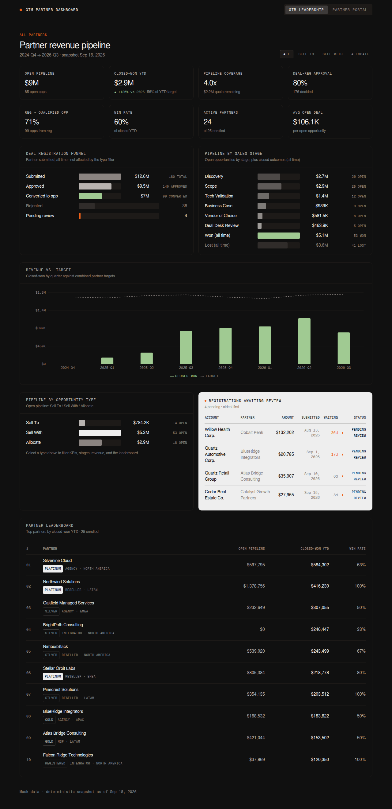
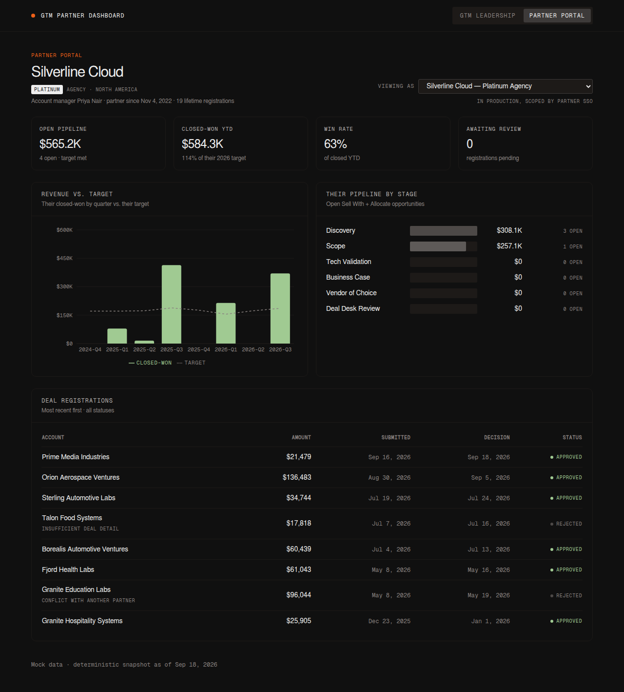

# GTM Partner Dashboard

Mockup of a partner revenue pipeline dashboard for the GTM team. Two views over
one data model: an internal **GTM Leadership** view aggregating all partner
performance, and a **Partner Portal** view scoped to a single partner.




The interface follows Factory's external brand system: near-black canvas
(#101010), bone type (#EEEEEE), Geist / Geist Mono, 1px hairline borders, no
shadows, and two functional accents only — signal orange for live status and
metric green for positive data.

## Views

### GTM Leadership (internal)

- KPI row: open pipeline, closed-won YTD (with YoY delta), pipeline coverage vs.
  remaining quota, deal-reg approval rate, registration → qualified-opportunity
  conversion, win rate, active partners, average open deal size
- Deal registration funnel: submitted → approved → converted, with rejected and
  pending alongside
- Pipeline by sales stage: Discovery → Scope → Tech Validation → Business Case →
  Vendor of Choice → Deal Desk Review, plus won / lost outcomes
- Revenue vs. target by quarter
- Pipeline by opportunity type: Sell To / Sell With / Allocate (the type filter
  applies to KPIs, stages, revenue, and the leaderboard)
- Registrations awaiting review — the actionable queue
- Partner leaderboard

### Partner Portal (partner-facing)

- Simulates the partner-scoped view; in production this sits behind partner SSO
  and the picker does not exist
- Shows Sell With and Allocate opportunities only — Sell To is internal-only
- Their registrations with status, their stage progression, and their revenue vs.
  their quarterly target

## Running locally

```bash
npm install
npm run dev       # http://localhost:5173
npm run lint
npm run build     # type-checks, then bundles to dist/
npm run preview
```

## Data contract (the integration seam)

The UI only talks to the `DataProvider` interface
([`src/data/DataProvider.ts`](src/data/DataProvider.ts)):

| Method                | Returns                 | Future source                              |
| --------------------- | ----------------------- | ----------------------------------------- |
| `listPartners()`      | `Partner[]`             | PRM / CRM partner accounts                |
| `listRegistrations()` | `DealRegistration[]`    | CRM "Deal Registration" custom object     |
| `listOpportunities()` | `Opportunity[]`         | CRM opportunities (stages + `oppType`)    |
| `getTargets()`        | `Target[]`              | Quota objects or warehouse                |

`MockDataProvider` fills the seam with deterministic, seeded data today. To go
live, implement the interface against your CRM (HubSpot, Salesforce) or
warehouse (Snowflake, Looker) and swap the provider in `App.tsx`. No view code
changes.

## Mock data

- Deterministic: mulberry32, seed `20260918` — identical on every load and build
- Fixed snapshot: 2026-09-18 (`SNAPSHOT_DATE`) so numbers never drift
- 25 partners, 180 registrations, ~185 opportunities across 8 quarters
  (2024-Q4 → 2026-Q3)
- Approval rate ~85%, registration → opportunity conversion ~70%, win rate ~55%
  of closed deals
- Volumes and weights are tuned in
  [`src/data/mock/generate.ts`](src/data/mock/generate.ts)

## Deployment (GitHub Pages)

1. Merge to `main` — the `deploy-pages.yml` workflow builds and publishes
2. One-time: repo Settings → Pages → Source: **GitHub Actions**
3. Live at `https://smash4920.github.io/GTM-Partner-Dashboard/`

CI (`ci.yml`) runs lint + build on every pull request.
