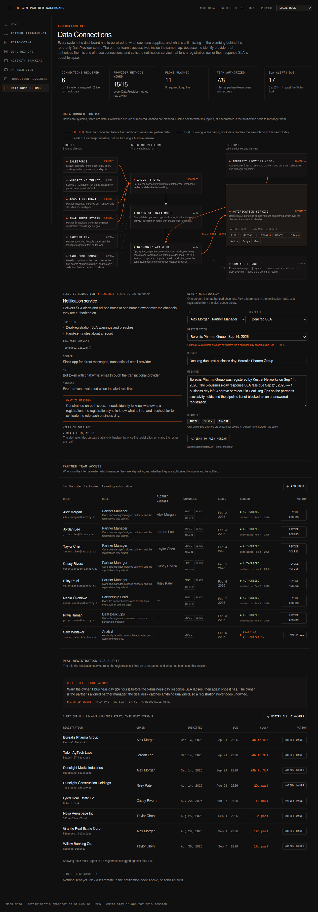

# GTM Partner Dashboard

Mockup of a partner revenue pipeline dashboard for the GTM team. Seven views over
one data model, reached through a collapsible left sidebar: **Home** (ecosystem
summary), **Partner Performance** (per-manager / per-partner drill-down),
**Forecasting** (the VP's in-quarter view with a weighted forecast),
**Deal Reg Ops** (registration SLAs, conversion time, exclusivity, and
conflicts), **Activity Tracking** (weekly meeting goals and calendar logging),
**Partner View** (the partner-facing sharing surface), **Production
Requirements** (the architecture + utility roadmap), and **Data Connections**
(the integration map, partner-team access, and registration SLA notifications).




The interface follows Factory's external brand system: near-black canvas
(#101010), bone type (#EEEEEE), Geist / Geist Mono, 1px hairline borders, no
shadows, and two functional accents only — signal orange for live status and
metric green for positive data.

## Navigation

A collapsible sidebar on the left carries the four pages; the icon in the upper
left expands and collapses it to an icon rail. The header also carries a
**provider selector** — local mock, simulated remote, or a 100× book — which is
the demo of the integration seam described under Data contract below.

## Pages

### Home

High-level summary statistics for the whole partner ecosystem. Always scoped to
**All Partners** — per-manager drill-downs live on Partner Performance.

- KPI row: open pipeline, closed-won for the selected phase (with a prior-year
  delta), pipeline coverage vs. remaining quota, deal-reg approval rate,
  registration → qualified-opportunity conversion, win rate, active partners,
  average open deal size
- Fiscal phase toggles: FY, Q1, Q2, Q3, Q4 for a February-start fiscal year.
  Phase-filtered pipeline spans the whole selected phase — open deals
  scheduled after the snapshot still count — while closed outcomes accrue only
  through the snapshot
- Deal registration funnel: submitted → approved → converted, with rejected and
  pending alongside
- Pipeline by sales stage: Discovery → Scope → Tech Validation → Business Case →
  Vendor of Choice → Deal Desk Review, plus won / lost outcomes
- Revenue vs. target by quarter
- Pipeline by opportunity type: Sell To / Sell With / Allocate (the type filter
  applies to KPIs, stages, revenue, and the leaderboard)
- Registrations awaiting review — the actionable queue
- Weekly partner activity tracker, fed by Activity Tracking classifications
- Partner leaderboard

### Partner Performance

Drill-down into specific partnership metrics. Two dropdowns on the right pick
the scope: **Partner manager** (all managers or one) and **Partner** (All
Partners aligned to that manager, or a single partner, via Salesforce-style
`Account.Partner_Manager__c` assignments).

- The same KPI row, registration funnel, stage breakdown, and revenue-vs-target
  chart, all scoped to the selection
- Meeting tracker alongside progress to the weekly goal for that scope
- Salesforce-shaped opportunity table: client, Factory Account Director, stage,
  forecasted revenue, and close date (actual close once closed, expected close
  while open)
- Pending registrations, scoped leaderboard, and — for a single partner —
  Partner Strategist / Partner Engineer certification against goal. When the
  scope includes multiple partners, the leaderboard shows each partner's
  certified counts and attainment beneath the count.
- Registrations awaiting review are colored against the **5-business-day
  response SLA**, and the waiting counter is quoted in the same unit —
  business days, not calendar days. A Friday submission is one business day
  old on Monday, not three, so the number and the color can never disagree
- After the awaiting-review block: **Exclusivity lapsed** flags every approved
  registration that never became an opportunity, with the 60-day window from
  approval shown per row
- Registration **conversion time** (submitted → approved → opportunity → win)
  and **leakage** counts (approved without an opportunity, exclusivity lapsed,
  pending past SLA, duplicate clients)
- **Duplicate & conflicting registrations** — clients registered by more than
  one partner, with submission dates so the first partner to submit is visible.
  Internal only; never rendered in the partner portal

### Forecasting

The VP of Partnerships' in-quarter read on FY27-Q3.

- Callout tiles: partner sourced pipeline, closed-won (with % attainment to the
  quarterly goal), pipeline coverage to goal, average deal size, and days left
  in the quarter
- **Weighted forecast call-outs**: every open deal carries a forecast category
  — Commit (90%), Best Case (50%), Pipeline (25%), Long Shot (10%) — and each
  category's probability-weighted contribution is summed into a total expected
  revenue, above the raw pipeline numbers
- **Week-over-week pipeline** sits directly below the call-outs: one cluster per
  week of the quarter, the open pipeline stacked by forecast category (solid)
  beside the same book weighted by close probability (faded), with the quarter's
  revenue goal as a dashed line. Dollars on the Y axis, weeks on the X, and the
  axis spans the whole quarter — weeks that have not begun are empty slots, so a
  new bar appears as each week starts. Hovering a week gives both totals and the
  week-over-week change.

  Closed weeks are read from the **weekly pipeline snapshot** (see Data
  contract), not reconstructed from today's book, and that distinction is the
  point: a snapshot already written never moves, so correcting a revenue figure
  or re-calling a deal today shifts the live week and leaves history alone.
  Reading the past off current state instead would backdate every later change —
  an amount raised this week would rewrite the weeks before it, a re-call would
  re-color them, and a deal that slipped out of the quarter would vanish from
  the weeks it was in rather than showing the drop. The tooltip names which kind
  of week you are looking at; where no history exists, a week falls back to the
  reconstruction and says so

- In-quarter opportunities grouped into a collapsible section per partner
  manager; each header shows their opportunity count, open pipeline, and
  closed-won, and expands to their book. The view reads five aggregates and
  fetches **one page of 25 rows per expanded manager**, so nothing on the page
  grows with the size of the book
- Table fields: Client, Partner, Revenue Forecast, Opportunity Type, Stage,
  Forecast Category, Close Date, Next Step, and Notes
- **Revenue Forecast**, **Forecast Category**, **Notes**, and **Next Step**
  each carry a pencil. An edited revenue forecast overrides the Salesforce
  figure and immediately updates every metric across the app, so a manager's
  number can differ from the CRM's. Notes never render inline — they are stored
  as comments and appear on hover over the comment icon. Next Step is an
  inline editable text field per row
- **Forecast Category is an editable call, not a derived badge.** The deal's
  stage supplies a starting point (Discovery → Long Shot, Scope → Pipeline,
  Tech Validation → Best Case, late funnel → Commit), but the call belongs to
  the manager: clicking the pencil opens a dropdown of the four probability
  buckets — Commit (90%), Best Case (50%), Pipeline (25%), Long Shot (10%) —
  and picking one re-calls the deal, which recalculates the weighted forecast
  and every category tile immediately. Closed rows carry no pencil — the call
  stops mattering once the deal resolves
- **Calls that disagree with stage** sits above the table: deals called _above_
  their stage (more confident than the funnel supports — a stale stage or an
  optimistic call) and _below_ it (late-funnel deals the manager has downgraded,
  which still read as healthy on any stage report). Where category and stage
  agree, the category adds no information, so these disagreements are the
  forecast conversation. Individual rows are tagged "off stage". Forecast
  accuracy by partner, manager, motion, and quarter remains on the roadmap

### Deal Reg Ops

The ops-led read on the registration book, whole-org and time-agnostic so
leakage spanning quarters stays visible.

- KPI tiles: average days per hop of the chain **submitted → approved →
  opportunity created → win**, pending registrations past the 5-business-day
  SLA, and registrations past the 60-day **exclusivity window**
- Conversion-time bars with the SLA and exclusivity windows annotated against
  each hop
- Pending registrations queue with the SLA-colored day counters
- **Exclusivity window**: approved registrations still without an opportunity,
  flagged "Exclusivity lapsed" once the 60 days from approval pass — the lead
  keeps exclusivity until the partner introduces it
- **Duplicate & conflicting registrations**: all clients registered by more
  than one partner, with every submission date so the earliest submission is
  obvious. Internal only
- The same section appears inside Partner View, scoped to that partner's own
  registrations (timeline + exclusivity), with conflicts and other partners'
  submissions excluded

### Activity Tracking

Organized by partner manager and their assigned partners, with dropdowns for
**Partner manager** and **Partner** (All Partners, each assigned partner, or
**＋ Add partner…** to log a call with a new prospect mid-week).

- Progress to weekly goal: 10 partner meetings per week, 3 of them Partner-
  Identified Opportunity Interlocks, plus this week's split by call type
- **Log Meetings** opens a Google Calendar-style weekly view of that manager's
  calendar. Every call is a tile within its day carrying two dropdowns,
  **Partner** and **Call Type**; Submit commits the classifications, which feed
  the progress bars and the weekly activity charts
- Call types: Discovery, PIO Interlock, PAO Interlock, Interlock Cadence, Deal
  Support, Technical Enablement, GTM Enablement, and Partner Cadence

In-app edits (revenue, forecast-category calls, notes, next steps,
classifications, added prospects, roster changes, sent notifications) live in
React state for the session; a write-capable provider is the next step.

### Partner View

The partner-facing sharing surface, designed for a future partner SSO boundary.
The picker simulates which partner is viewing the shared platform today.

- Sell With and Allocate opportunities only; Sell To remains internal-only
- Partner-scoped pipeline, closed-won, win rate, awaiting-review registrations,
  opportunity details, revenue-vs-target trend, stage pipeline, and revenue
  motion breakdown
- **Deal registration timeline**: average conversion time across the partner's
  own registrations (submitted → approved → opportunity → win)
- **Exclusivity window**: the partner's approved registrations still without an
  opportunity, flagged once the 60-day introduction window lapses
- Partner Strategist and Partner Engineer certification counts with goal
  attainment

### Production Requirements

Two tracked backlogs and the order they get built in. Every item on all three
boards carries a **status** stamped against what the code actually does today —
**Complete** (landed and working in the demo), **WIP** (partially implemented,
usually the client-side half), **Pending** (not started, but buildable in demo
mode without production access), and **Prod Only** (blocked until production
connections or infrastructure exist — connecting the CRM, identity provider, or
warehouse happens at go-live, not before) — next to a "statuses last updated"
date, the day the stamps were last reviewed against the code, so a Complete
that has gone stale is visibly stale. The **Architecture
roadmap** documents the server-side foundation required before connecting
protected systems (identity and row-level authorization, source-system
integration, persistence and audit, security and compliance, reliability, and
feature-delivery governance). The
**Migration Path** sequences that foundation into six phases. The first two
needed no infrastructure and no production data, and both have landed in demo
mode against `MockDataProvider`: Phase 0 is the test infrastructure (27.88% →
91.72% statements, gated in CI) and Phase 1 is the contract rewrite, with
Forecasting migrated end to end, weekly history off the client contract, and the
provider switcher in the header. They are what make the later phases safe. Full
reasoning — where the current design breaks at volume, the contract change
everything else follows from, what shipped and what it measured, and rough
sizing — lives in
[`docs/migration-plan.md`](docs/migration-plan.md). The **Utility
Improvements** section is the GTM
Partnerships leader's product roadmap — forecast quality, partner health and
lifecycle, deal-registration operations, actionability, partner portal utility,
attribution and crediting, and services delivery (which partner delivers which
service type for which client, whether Factory revenue is attached or it is a
long-term adoption play, and what the engagement produced) — separated from the
architecture work so the two tracks can be prioritized independently.

### Data Connections

The integration map and the two things that hang off it: who on the partner
team can be told about the data, and the rule that tells them.

- **Data connection map** — a wire diagram of every system the dashboard reads
  from or writes to, drawn from one catalog
  ([`src/data/connections.ts`](src/data/connections.ts)) so the boxes and the
  wires cannot disagree about where a node sits. Boxes are systems, wires are
  data. Color is state only: **required** (signal) is a connection that has to
  exist before real partner data can be served, **live** (metric) is flowing
  through the DataProvider seam today, **planned** (graphite, dashed) is
  roadmap. Click a box for what it supplies, the DataProvider methods it fills,
  its source object, auth, cadence, and — the point of the view — what is still
  missing and which roadmap track owns it. Each node's `methods` name the
  DataProvider method it fills, so the map and the contract in
  `DataProvider.ts` can be read against each other; a test asserts every method
  there is covered here
- **Partner team access** — the internal roster the identity provider owns,
  projected into the dashboard. Adding a person puts them on the roster
  _awaiting authorization_; authorizing is a second, separate step, which is
  the split a real IdP enforces between knowing who should have access and
  granting it. A user is either a Partnership Lead, a Partner Manager (aligned
  to one partner manager, which is what routes a registration to them), Deal
  Desk Ops (the whole queue), or an Analyst; each carries the notification
  channels they are authorized on. Access can be revoked and restored, and a
  user added this session can be removed
- **Deal-registration SLA alerts** — the notification rule, the registrations
  it fires on, and what has been sent this session. Every pending registration
  is measured against the 5-business-day response SLA at the snapshot; one
  business day (24 hours) before the deadline the owner is warned, and once it
  has passed the breach is raised. The owner is the submitting partner's
  aligned partner manager, with the deal desk catching anything unaligned, so a
  registration never goes unowned. The 24-hour warnings lead the queue — they
  are the ones with a working day left in them
- **Notifications** are sent from inside the map: pick a teammate in the
  notification node and it loads their own most urgent alert, or pick a
  registration from the alert queue, or write a free-form note. Delivery goes
  out over the user's authorized channels only, and the send is logged. Sends
  are timestamped off the session clock, not the fixed snapshot: the demo data
  is frozen at Sep 18, but an action taken now happened now

## Running locally

Requires **Node 22.13 through 24** (`engines.node` in `package.json`). Node 20
reached end-of-life in April 2026 and the current Vite / Vitest / ESLint majors
no longer support it. The upper bound keeps the Vercel build on a tested major
instead of rolling onto a future release automatically.

```bash
npm ci
npm run dev             # http://localhost:5173
npm run check:file-limits # reject files over 1 MiB or 1,200 text lines
npm run format          # format source, configuration, and documentation
npm run format:check    # verify formatting without changing files
npm run dead-code       # find unused files, exports, and dependencies with Knip
npm run lint            # lint source and enforce module boundaries
npm run debt:check      # require source debt markers to link to GitHub issues
npm run lint
npm run lint:duplicates # jscpd: fail if source duplication exceeds 1.5%
npm test                # vitest: fiscal/metric helpers, the data contract, the provider seam, the view layer
npm run test:build-metrics # verify build timing, budgets, and output measurements
npm run test:debt       # verify the technical-debt policy scanner
npm run test:coverage   # the same suite with coverage, enforcing the thresholds in vite.config.ts
npm run test:coverage:ci # coverage plus the per-test timing report used by CI
npm run test:e2e        # playwright: browser workflows and partner-data boundaries
npm run test:list       # collect and list tests without running them
npm run build           # type-checks, bundles to dist/, and records build performance
npm run bundle:check    # build, enforce compressed JS budgets, and create a treemap report
npm run preview
```

### Test performance

CI records the duration of every Vitest test and suite in
`test-results/vitest-junit.xml`. Each workflow run publishes those timings as a
GitHub test report, so pull requests expose slow tests alongside pass/fail
results, and retains the raw report as a `unit-test-results-*` artifact for 90
days. This makes gradual test-suite slowdowns visible instead of allowing them
to silently make developer feedback slower.

Run `npm run test:coverage:ci` to produce the same timing report locally. The
regular `npm run test:coverage` command remains the faster choice when no
machine-readable report is needed.

### Build and bundle performance

`npm run build` measures the TypeScript and Vite stages separately and writes a
machine-readable report to `build-metrics/build.json`. The report includes the
total duration, stage timings, build status, output file count and bytes, commit
SHA in CI, and whether the exact TypeScript incremental-cache key was restored.
It also creates `build-metrics/bundle-report.html`, an interactive treemap that
shows each module's raw, gzip, and Brotli contribution to the production chunks.

The build has a 60-second performance budget. Set `BUILD_BUDGET_MS` to tune it
for a known environment; exceeding the budget fails the build so regressions
cannot pass unnoticed. `npm run bundle:check` additionally enforces the
compressed JavaScript budgets in `package.json`, both for the whole bundle and
for the application, Recharts, and chart dependency chunks. CI runs that check,
restores TypeScript's incremental build state, publishes the measurements in
the workflow summary, and retains the JSON metrics and HTML treemap as a
`build-analysis-*` artifact for 90 days.

### Runtime performance metrics

Production builds can send real-user Web Vitals to any HTTP metrics collector.
Set `VITE_METRICS_ENDPOINT` at build time to enable collection. The app observes
CLS, FCP, INP, LCP, and TTFB with the maintained
[`web-vitals`](https://github.com/GoogleChrome/web-vitals) library and delivers
each measurement with `navigator.sendBeacon`, falling back to a keepalive
`fetch` request.

```bash
VITE_METRICS_ENDPOINT=https://metrics.example.com/v1/browser \
VITE_METRICS_SAMPLE_RATE=0.25 \
VITE_DEPLOYMENT_ENV=production \
VITE_RELEASE="$GIT_SHA" \
npm run build
```

`VITE_METRICS_SAMPLE_RATE` is the fraction of page loads to observe, from `0`
through `1`, and defaults to `1`. The JSON payload includes a schema version,
application, environment, optional release, timestamp, route pathname, and the
metric name, value, delta, rating, ID, and navigation type. Query strings,
hashes, user input, and customer records are never included. Cross-origin
collectors must allow anonymous JSON `POST` requests from the dashboard origin;
the client deliberately omits credentials. Leaving the endpoint empty disables
runtime collection, which is the default for local development.

### Technical debt

Source-level debt must remain visible and actionable. Use `TODO(#123): reason`,
`FIXME(#123): reason`, `HACK(#123): reason`, or `XXX(#123): reason`, where the
number links to an issue in this repository. A full
`https://github.com/smash4920/gtm-partner-dashboard/issues/123` URL is also
accepted. The explanation should state what needs to change or when the marker
can be removed.

`npm run debt:check` scans tracked and untracked, non-ignored source and
configuration files. CI runs it on every pull request and push to `main`, so an
unlinked marker cannot silently become permanent.

### Logging

The app logs through [`src/lib/logging.ts`](src/lib/logging.ts): every event
is one structured record — `time`, `level`, `msg`, and flat context fields —
written to the browser console, so DevTools filters by level and reads fields
without parsing prose. `Error` values serialize to name, message, and stack;
circular or oversized values are cut off, never thrown on. Data loads, session
edits, notification sends, and render crashes (caught by
`src/components/ErrorBoundary.tsx`) all leave records.

The minimum level defaults to `debug` in development and `warn` in production
builds; `VITE_LOG_LEVEL` (`debug` / `info` / `warn` / `error`) overrides it.
Vite inlines the value at build time, so set it on the `dev` or `build`
command, not `preview`:

```bash
VITE_LOG_LEVEL=debug npm run dev
```

### Feature flags

Feature flags live in two governed registries: product flags in
[`src/lib/featureFlags.ts`](src/lib/featureFlags.ts) and operational telemetry
flags in [`src/lib/telemetry/flags.ts`](src/lib/telemetry/flags.ts). Every flag
in both registries carries the full lifecycle defined in
[`src/lib/flagGovernance.ts`](src/lib/flagGovernance.ts): owner, purpose,
environment scope, safe default, rollout trigger, rollback trigger, review
date, expiry, and removal condition. A deterministic policy check
(`npm test -- src/lib/featureFlags.test.ts src/lib/telemetry/flags.test.ts`)
fails on missing metadata, missing ownership, or an expired flag.

All flag inputs are local and non-authoritative: build-time environment
variables inlined by Vite, plus session-only in-memory overrides. There is no
remote flag service and no privileged control UI, and the app makes no
flag-service request. A flag can hide a feature route, but it never grants a
role, changes which rows a partner or manager can see, or otherwise alters
access. That separation is enforced architecturally — flag modules cannot
import access-scope or provider logic — and pinned by an
authorization-invariance test that verifies identical scope and row IDs in
every evaluator state.

Evaluation is fail-safe and deterministic:

1. A fresh, valid configured value is used and recorded as last known good.
2. On a timeout, an unavailable source, or a malformed value, the recorded
   value is used only while it is younger than its configured maximum age
   (`FLAG_CACHE_MAX_AGE_MS`, five minutes).
3. Cold start, an absent cache, or a stale cache falls back to the registry's
   safe default, so an outage can never turn a feature on or hold an outdated
   value past its bound. The cache is in-memory only, so a reload is always a
   cold start.
4. A later valid value replaces the cache, so recovery is immediate.

The full matrix — cold start, timeout, unavailable, malformed, bounded cache,
stale cache, and recovery — is pinned by injected-clock tests in
[`src/lib/featureFlags.test.ts`](src/lib/featureFlags.test.ts).

Copy [`.env.example`](.env.example) to `.env.local` for local configuration,
or set the variables in the deployment environment:

```bash
# Immediate off switch
VITE_FEATURE_PRODUCTION_REQUIREMENTS=false npm run build

# Stable 25% rollout when no explicit override is set
VITE_FEATURE_PRODUCTION_REQUIREMENTS_ROLLOUT=25 npm run build
```

Explicit `true` or `false` overrides take precedence over percentage rollout.
Accepted aliases are `1`/`0` and `on`/`off`. Invalid values are treated as
malformed and fall back through the fail-safe policy above instead of making
an accidental rollout decision.

Percentage assignment hashes the flag key with an opaque browser identifier.
The identifier is stored under `gtm.feature-flags.subject.v1`; it contains no
user or partner data. If browser storage is unavailable, assignment remains
stable for the current page. Vite inlines flag configuration at build time, so
changing a deployment flag requires a rebuild.

This local, build-time implementation is the safe starting point, not the
final maintainer experience. The Production Requirements roadmap still calls
for an authenticated control plane where approved nontechnical maintainers can
change flags without editing code or redeploying — that capability is
Production: Prod Only. Such a control plane must include separate environment
settings, role-based access, approvals, audit history, emergency kill
switches, and safe behavior when the flag service is unavailable. Feature
flags must never replace authorization or data-access controls. See
[`docs/migration-plan.md`](docs/migration-plan.md#feature-flag-methodology-and-maintainer-control-plane).

### Runtime observability

The client includes opt-in, privacy-safe telemetry. With no telemetry
variables configured, records remain in-process and no network request is made.
Egress is governed by two switches: the `telemetry.enabled` master switch
controls every request, beacon, and script load, and product analytics
additionally requires `analytics.enabled`, which defaults off pending privacy
approval. Every envelope passes a registered per-type field allowlist before
it can be queued, so names, free-form prose, raw exception text, records, and
secrets cannot leave the browser. Production collector endpoints must be
HTTPS on a host in the checked-in `APPROVED_TELEMETRY_HOSTS` list (currently
empty, so production telemetry stays local-only until a host is approved in a
reviewed change); invalid configuration fails closed to local-only. There is
no browser webhook delivery: alerts dispatch to in-app handlers only, and
production builds emit no source maps.

Production builds may set these Vite variables:

- `VITE_TELEMETRY_ENDPOINT` — collector URL for batched logs, metrics, events,
  traces, errors, alerts, and health envelopes. Subject to the HTTPS and
  approved-host policy above.
- `VITE_TELEMETRY_DASHBOARD_URL` — operator dashboard link stamped on batches
  and used by the deployment runbook.
- `VITE_RELEASE` — git SHA or release tag; Vercel's commit SHA is the fallback.
- `VITE_GA_MEASUREMENT_ID` — optional GA4 measurement ID for product events.
  Inert unless both telemetry and analytics switches are on.
- `VITE_FLAG_TELEMETRY_ENABLED` and `VITE_FLAG_ANALYTICS_ENABLED` — explicit
  build-time feature switches.

The app exposes a live readiness artifact at `window.GTM_HEALTH`. Run
`await window.GTM_HEALTH.refresh()` in the deployed page to check the shell,
network, flags, telemetry delivery, recent errors, and the real data-provider
seam. Production builds ship no public source maps: a published map would
expose the full original source to anyone who downloads the bundle.

#### Error to insight pipeline

The scheduled [`Error to Insight`](.github/workflows/error-to-insight.yml)
workflow converts unresolved Sentry errors into actionable GitHub issues every
hour. Each issue links to the Sentry event group, records frequency and affected
users, and includes a triage checklist. A hidden Sentry issue ID makes the sync
idempotent. If an error regresses after its GitHub issue was closed, the
workflow reopens the same issue instead of creating a duplicate. A per-run cap
prevents an initial backlog from flooding the issue tracker.

Configure the repository before enabling the schedule:

1. Send the telemetry collector's `error` envelopes to a Sentry project. The
   envelopes carry the technical classification only — error class,
   fingerprint, category, severity, route, provider, and trace context — with
   release and environment stamped at the batch level. Raw messages, stacks,
   and breadcrumbs never leave the browser.
2. Add repository variables `SENTRY_ORG` and `SENTRY_PROJECT` with that
   project's organization and project slugs.
3. Add `SENTRY_AUTH_TOKEN` as a repository secret. Use a dedicated,
   read-only Sentry token with project and organization read access.
4. Run the workflow manually with `dry_run` enabled. Review the proposed issue
   count, then run it without `dry_run`.

The workflow's `GITHUB_TOKEN` receives only `contents: read` and `issues: write`.
It never exposes the Sentry token to application code. Change
`SENTRY_ISSUE_QUERY` or `SENTRY_MAX_NEW_ISSUES` in the workflow to tune
severity, environments, or rollout volume.

`npm ci` installs a Husky pre-commit hook. Every commit checks AGENTS.md
freshness, file-size limits, and technical-debt markers, then runs the linter,
the dead-code and duplicate-code scans, and the Vitest suite, preventing stale
documentation, oversized files, untracked debt, and known quality failures from
entering the repository. Generated package-manager lockfiles are exempt from
the 1,200-line limit, but all files remain subject to the 1 MiB limit.

The linter also enforces the source dependency direction configured in
[`eslint.config.js`](eslint.config.js): the app shell may compose views, views
may use reusable components, and UI layers may depend on data contracts and
domain helpers. Data and domain modules cannot reach back into the UI, and
production views and components cannot import mock providers directly. Tests
may cross these boundaries to construct fixtures.

### Dev container

Open the repository in VS Code with the
[Dev Containers extension](https://marketplace.visualstudio.com/items?itemName=ms-vscode-remote.remote-containers)
or create a GitHub Codespace to use the checked-in development environment.
The container provides Node.js 22 on Debian, installs the locked dependencies
with `npm ci`, and configures ESLint, Tailwind CSS, and the workspace TypeScript
version. Start the app with `npm run dev`; port 5173 is forwarded and opens in
the browser automatically.

### Releases and changelog

The [Release Please workflow](.github/workflows/release-please.yml) runs after
changes reach `main`. It maintains a release pull request that updates
`CHANGELOG.md` and the package version from conventional commit messages.
Merging that pull request creates the version tag and GitHub release with the
same generated notes.

Use `feat:` for user-visible features, `fix:` for user-visible fixes, and
`type(scope):` when a scope makes the entry clearer. Mark a breaking change
with a `BREAKING CHANGE:` footer. Other conventional types such as `docs:`,
`test:`, and `chore:` remain valid but do not create misleading feature or fix
entries. Do not edit `.release-please-manifest.json` by hand outside a release
bootstrap or recovery. The configured bootstrap commit marks the start of
automated release history, so the first release does not claim older changes.

## Data contract (the integration seam)

The UI only talks to the `DataProvider` interface
([`src/data/DataProvider.ts`](src/data/DataProvider.ts)), which is mid-migration
and deliberately reads that way. Two families:

**The target shape — scoped aggregates and paginated rows.** A caller states a
scope (a fiscal quarter, optionally one partner manager, plus the session's
uncommitted edits) and receives an answer whose size does not depend on the size
of the book. **Forecasting is built on this today.**

| Method                       | Returns                                                     |
| ---------------------------- | ----------------------------------------------------------- |
| `getForecastSummary()`       | `ForecastSummary` (9 numbers)                               |
| `getWeightedForecast()`      | `WeightedForecastSummary`                                   |
| `getForecastQuality()`       | `ForecastQualitySummary` (counts, exposure, bounded sample) |
| `getManagerForecastGroups()` | `ManagerForecastGroup[]` (one row per manager)              |
| `getWeeklyForecastSeries()`  | `WeeklySeriesRow[]` (13 buckets)                            |
| `listQuarterOpportunities()` | `Page<Opportunity>` (cursor, 25 rows)                       |
| `getPartnerDirectory()`      | `PartnerRef[]` (id → name)                                  |

**The shape being retired — eight list-everything calls.** `listPartners()`,
`listOpportunities()`, `listRegistrations()`, `getTargets()`,
`listPartnerManagers()`, `listActivities()`, `listCertifications()`,
`listTeamUsers()`. The seven views still on this contract take the whole book
and aggregate it in the browser.

`MockDataProvider` fills both with deterministic, seeded data. To go live,
implement the interface against your CRM (HubSpot, Salesforce) or warehouse
(Snowflake, Looker) and swap the provider — no view code changes. The scoped
side is where a server does the arithmetic: `src/lib/metrics.ts` is the
implementation today and the _specification_ a server implementation has to
match, which is what makes its test suite a conformance check rather than a
unit suite.

**Swap the provider from the header** to see the claim performed:

- **Local mock** — the deterministic in-memory book, answering on the next
  microtask. Fast, and it hides every loading state.
- **Simulated remote** — the same book behind ~250 ms round trips with a 15%
  simulated failure rate, so the per-widget loading, error, and retry paths are
  exercised rather than theoretical. Seeded, so a failing run can be replayed.
- **Scaled 100×** — 100 copies of the book: 2,500 partners, 21,300
  opportunities, 191,000 weekly snapshot rows, ~45 MB. The scoped queries return
  the same kilobytes (five aggregates, 25 rows a page); the load-everything path
  is what changes. That is the argument, and it is why the default is the local
  mock: this provider deliberately makes the un-migrated views slow.

The interface is read-only. `App.tsx` layers the session's in-app edits —
revenue overrides, forecast-category calls, notes, next steps, meeting
classifications, added prospects, roster changes, and sent notifications — on
top of the provider's book before handing a single merged `DashboardData` to the
views still on the old contract; Forecasting instead passes the edits _into_ its
queries, so the provider aggregates the corrected book itself. Writes are the
one thing a live provider still needs to add.

**Weekly pipeline history never crosses the seam whole.** It used to arrive as
`listPipelineSnapshots()`: 1,911 rows in the demo and ~87% of the payload at
production volume, carrying each open deal's amount, called category, stage, and
expected close as they stood every Monday. It was millions of rows to answer a
question about fourteen weeks, so the collection is off the client contract
entirely and leaves through `getWeeklyForecastSeries()` as ~13 buckets. A
`PipelineSnapshot` is still the only way to answer a question about a past week
— an `Opportunity` holds one amount and one call, so reading the past off
current state backdates every later change — and it is still what makes forecast
accuracy measurable, since a call can only be scored against an outcome if the
call as made was kept. It lives in `ProviderBook` (provider-side) rather than
`DashboardData` (client-side), and in Salesforce it is `OpportunityHistory` and
`OpportunityFieldHistory`; a warehouse would model it as a weekly fact table
written by a scheduled job.

## Mock data

- Deterministic: mulberry32, seed `20260918` — identical on every load, build,
  and `generateDashboardData()` call
- Fixed snapshot: 2026-09-18 (`SNAPSHOT_DATE`) so numbers never drift
- 5 partner managers, each aligned to 5 partners through a Salesforce-style
  account relationship, each with an authorized Partner Manager user aligned to
  them; the 8-person roster also carries a partnership lead, a deal-desk ops
  user, and an analyst still awaiting authorization
- 25 partners, 180 registrations, 213 opportunities — the FY27 book
  (February 2026 → January 2027) plus a closed prior-year FY26 book that only
  feeds the prior-year delta tiles — and 163 mock calendar meetings: a seeded
  pool across the previous seven weeks, plus a full current week per partner
  manager (7–12 calls each) so the weekly goal and Log Meetings have a real
  calendar to work from
- Every opportunity carries a forecast category; open deals carry a manager's
  called category, roughly one in five deliberately off its stage-implied
  bucket in both directions (deterministic from the id, so no PRNG sequence or
  pinned volume shifts), and close-date-adjacent deals with no explicit call
  fall back to the stage heuristic. Open opportunities also carry a row-level
  next step (about half of them, seeded deterministically from the id)
- 1,911 weekly pipeline snapshot rows: the open book recorded every Monday of
  FY27 through the snapshot date (33 recordings). Amounts, calls, stages, and
  expected close dates drift week to week — most deals never move, a minority
  were a bucket more cautious and a stage earlier a few weeks back, some grew as
  scope firmed up while others were cut, and a handful crossed a quarter
  boundary (7 deals slipped out of Q3, 4 were pulled in). Without that movement
  a snapshot series is just today's numbers repeated and the week-over-week
  chart shows nothing but deals entering and closing. Drift is derived from the
  opportunity id and week index rather than the seeded PRNG, so history shifts
  no existing volume or amount
- Every approved registration gets a 2–12 day document-handling dwell before
  its opportunity is created, so the submitted → approved → opportunity → win
  chain reads as real time; a fixed set of registrations deliberately shares a
  client with another partner so the duplicate/conflict views have rows, and
  older approved registrations are left unconverted so the exclusivity window
  has lapsed and still-current rows
- A few still-pending registrations are re-dated to one business day before
  their response SLA — one per partner — so the 24-hours-out notification rule
  has owners to reach at the snapshot. The warning window is only a day wide,
  and a natural distribution can contain none of it; the seeded working date is
  derived from the snapshot, and no PRNG is consumed, so no volume shifts
- Realized FY27 win rate: 20 of 44 closed deals won (~45%)
- Volumes and weights are tuned in
  [`src/data/mock/generate.ts`](src/data/mock/generate.ts); the exact volumes
  and the data contract are pinned by `src/data/mock/generate.test.ts`

## Deployment

### Vercel (current path)

The repo is private, so Vercel handles hosting and per-PR previews. One-time
setup: import the repo at vercel.com (framework **Vite**, build
`npm run build`, output `dist`), then enable **Settings → Deployment
Protection → Vercel Authentication** so only authorized users can open the
URLs. After that, every pull request gets its own preview URL automatically.

Note that Vercel's Hobby (free) plan is limited to non-commercial use; a
dashboard the GTM team actually relies on belongs on Pro.

### GitHub Pages (manual, currently blocked)

`deploy-pages.yml` is kept but runs only via **workflow_dispatch**. Pages
cannot publish from a private repo on a GitHub Free plan — the deploy step
fails with a 404. It becomes viable if the repo goes public or the account
moves to Pro; then enable Settings → Pages → Source: **GitHub Actions** and
run the workflow, which publishes to
`https://smash4920.github.io/GTM-Partner-Dashboard/`.

### Base path

Assets resolve differently per host, so `vite.config.ts` picks the base path
from the environment: `/` when `VERCEL` is set (Vercel serves at a domain
root), and `/GTM-Partner-Dashboard/` otherwise (Pages serves project sites
under the repo name). Set `BASE_PATH` to override for any other host.

CI (`ci.yml`) checks file-size limits, formatting, lint, coverage, and the
production build on every pull request and on every push to `main`.
CI (`ci.yml`) runs formatting + lint + duplicate-code detection + coverage +
build on every pull request and on every push to `main`.
