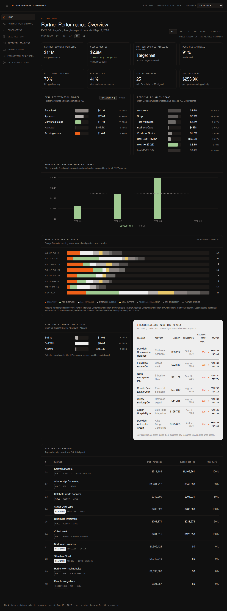
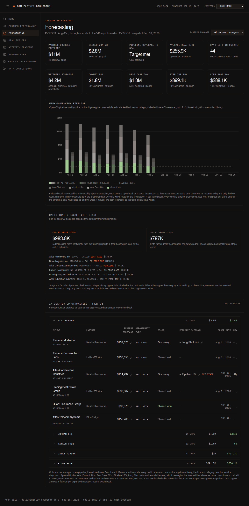

# GTM Partner Dashboard

Mockup of a partner revenue pipeline dashboard for the GTM team. Six views over
one data model, reached through a collapsible left sidebar: **Home** (ecosystem
summary), **Partner Performance** (per-manager / per-partner drill-down),
**Forecasting** (the VP's in-quarter view with a weighted forecast),
**Deal Reg Ops** (registration SLAs, conversion time, exclusivity, and
conflicts), **Activity Tracking** (weekly meeting goals and calendar logging),
**Partner View** (the partner-facing sharing surface), and **Production
Requirements** (the architecture + utility roadmap).




The interface follows Factory's external brand system: near-black canvas
(#101010), bone type (#EEEEEE), Geist / Geist Mono, 1px hairline borders, no
shadows, and two functional accents only — signal orange for live status and
metric green for positive data.

## Navigation

A collapsible sidebar on the left carries the four pages; the icon in the upper
left expands and collapses it to an icon rail.

## Pages

### Home

High-level summary statistics for the whole partner ecosystem. Always scoped to
**All Partners** — per-manager drill-downs live on Partner Performance.

- KPI row: open pipeline, closed-won for the selected phase (with a prior-year
  delta), pipeline coverage vs. remaining quota, deal-reg approval rate,
  registration → qualified-opportunity conversion, win rate, active partners,
  average open deal size
- Fiscal phase toggles: FY, Q1, Q2, Q3, Q4 for a February-start fiscal year.
  Phase-filtered pipeline spans the whole selected phase — open deals
  scheduled after the snapshot still count — while closed outcomes accrue only
  through the snapshot
- Deal registration funnel: submitted → approved → converted, with rejected and
  pending alongside
- Pipeline by sales stage: Discovery → Scope → Tech Validation → Business Case →
  Vendor of Choice → Deal Desk Review, plus won / lost outcomes
- Revenue vs. target by quarter
- Pipeline by opportunity type: Sell To / Sell With / Allocate (the type filter
  applies to KPIs, stages, revenue, and the leaderboard)
- Registrations awaiting review — the actionable queue
- Weekly partner activity tracker, fed by Activity Tracking classifications
- Partner leaderboard

### Partner Performance

Drill-down into specific partnership metrics. Two dropdowns on the right pick
the scope: **Partner manager** (all managers or one) and **Partner** (All
Partners aligned to that manager, or a single partner, via Salesforce-style
`Account.Partner_Manager__c` assignments).

- The same KPI row, registration funnel, stage breakdown, and revenue-vs-target
  chart, all scoped to the selection
- Meeting tracker alongside progress to the weekly goal for that scope
- Salesforce-shaped opportunity table: client, Factory Account Director, stage,
  forecasted revenue, and close date (actual close once closed, expected close
  while open)
- Pending registrations, scoped leaderboard, and — for a single partner —
  Partner Strategist / Partner Engineer certification against goal. When the
  scope includes multiple partners, the leaderboard shows each partner's
  certified counts and attainment beneath the count.
- Registrations awaiting review are colored against the **5-business-day
  response SLA**: counters are green inside the window, red past it
- After the awaiting-review block: **Exclusivity lapsed** flags every approved
  registration that never became an opportunity, with the 60-day window from
  approval shown per row
- Registration **conversion time** (submitted → approved → opportunity → win)
  and **leakage** counts (approved without an opportunity, exclusivity lapsed,
  pending past SLA, duplicate clients)
- **Duplicate & conflicting registrations** — clients registered by more than
  one partner, with submission dates so the first partner to submit is visible.
  Internal only; never rendered in the partner portal

### Forecasting

The VP of Partnerships' in-quarter read on FY27-Q3.

- Callout tiles: partner sourced pipeline, closed-won (with % attainment to the
  quarterly goal), pipeline coverage to goal, average deal size, and days left
  in the quarter
- **Weighted forecast call-outs**: every open deal carries a forecast category
  — Commit (90%), Best Case (50%), Pipeline (25%), Long Shot (10%) — and each
  category's probability-weighted contribution is summed into a total expected
  revenue, above the raw pipeline numbers
- In-quarter opportunities grouped into a collapsible section per partner
  manager; each header shows their opportunity count, open pipeline, and
  closed-won, and expands to their book
- Table fields: Client, Partner, Revenue Forecast, Opportunity Type, Stage,
  Forecast Category, Close Date, Next Step, and Notes
- **Revenue Forecast**, **Forecast Category**, **Notes**, and **Next Step**
  each carry a pencil. An edited revenue forecast overrides the Salesforce
  figure and immediately updates every metric across the app, so a manager's
  number can differ from the CRM's. Notes never render inline — they are stored
  as comments and appear on hover over the comment icon. Next Step is an
  inline editable text field per row
- **Forecast Category is an editable call, not a derived badge.** The deal's
  stage supplies a starting point (Discovery → Long Shot, Scope → Pipeline,
  Tech Validation → Best Case, late funnel → Commit), but the call belongs to
  the manager: clicking the pencil opens a dropdown of the four probability
  buckets — Commit (90%), Best Case (50%), Pipeline (25%), Long Shot (10%) —
  and picking one re-calls the deal, which recalculates the weighted forecast
  and every category tile immediately. Closed rows carry no pencil — the call
  stops mattering once the deal resolves
- **Calls that disagree with stage** sits above the table: deals called *above*
  their stage (more confident than the funnel supports — a stale stage or an
  optimistic call) and *below* it (late-funnel deals the manager has downgraded,
  which still read as healthy on any stage report). Where category and stage
  agree, the category adds no information, so these disagreements are the
  forecast conversation. Individual rows are tagged "off stage". Forecast
  accuracy by partner, manager, motion, and quarter remains on the roadmap

### Deal Reg Ops

The ops-led read on the registration book, whole-org and time-agnostic so
leakage spanning quarters stays visible.

- KPI tiles: average days per hop of the chain **submitted → approved →
  opportunity created → win**, pending registrations past the 5-business-day
  SLA, and registrations past the 60-day **exclusivity window**
- Conversion-time bars with the SLA and exclusivity windows annotated against
  each hop
- Pending registrations queue with the SLA-colored day counters
- **Exclusivity window**: approved registrations still without an opportunity,
  flagged "Exclusivity lapsed" once the 60 days from approval pass — the lead
  keeps exclusivity until the partner introduces it
- **Duplicate & conflicting registrations**: all clients registered by more
  than one partner, with every submission date so the earliest submission is
  obvious. Internal only
- The same section appears inside Partner View, scoped to that partner's own
  registrations (timeline + exclusivity), with conflicts and other partners'
  submissions excluded

### Activity Tracking

Organized by partner manager and their assigned partners, with dropdowns for
**Partner manager** and **Partner** (All Partners, each assigned partner, or
**＋ Add partner…** to log a call with a new prospect mid-week).

- Progress to weekly goal: 10 partner meetings per week, 3 of them Partner-
  Identified Opportunity Interlocks, plus this week's split by call type
- **Log Meetings** opens a Google Calendar-style weekly view of that manager's
  calendar. Every call is a tile within its day carrying two dropdowns,
  **Partner** and **Call Type**; Submit commits the classifications, which feed
  the progress bars and the weekly activity charts
- Call types: Discovery, PIO Interlock, PAO Interlock, Interlock Cadence, Deal
  Support, Technical Enablement, GTM Enablement, and Partner Cadence

In-app edits (revenue, forecast-category calls, notes, next steps,
classifications, added prospects) live in React state for the session; a
write-capable provider is the next step.

### Partner View

The partner-facing sharing surface, designed for a future partner SSO boundary.
The picker simulates which partner is viewing the shared platform today.

- Sell With and Allocate opportunities only; Sell To remains internal-only
- Partner-scoped pipeline, closed-won, win rate, awaiting-review registrations,
  opportunity details, revenue-vs-target trend, stage pipeline, and revenue
  motion breakdown
- **Deal registration timeline**: average conversion time across the partner's
  own registrations (submitted → approved → opportunity → win)
- **Exclusivity window**: the partner's approved registrations still without an
  opportunity, flagged once the 60-day introduction window lapses
- Partner Strategist and Partner Engineer certification counts with goal
  attainment

### Production Requirements

Two tracked backlogs. The **Architecture roadmap** documents the server-side
foundation required before connecting protected systems (identity and row-level
authorization, source-system integration, persistence and audit, security and
compliance, reliability). The **Utility Improvements** section is the GTM
Partnerships leader's product roadmap — forecast quality, partner health and
lifecycle, deal-registration operations, actionability, partner portal utility,
and attribution and crediting — separated from the architecture work so the two
tracks can be prioritized independently.

## Running locally

```bash
npm install
npm run dev       # http://localhost:5173
npm run lint
npm test          # vitest: fiscal/metric helpers + the mock data contract
npm run build     # type-checks, then bundles to dist/
npm run preview
```

## Data contract (the integration seam)

The UI only talks to the `DataProvider` interface
([`src/data/DataProvider.ts`](src/data/DataProvider.ts)):

| Method                | Returns                 | Future source                              |
| --------------------- | ----------------------- | ----------------------------------------- |
| `listPartnerManagers()` | `PartnerManager[]`     | Salesforce Account owner alignment        |
| `listPartners()`      | `Partner[]`             | PRM / CRM partner accounts                |
| `listRegistrations()` | `DealRegistration[]`    | CRM "Deal Registration" custom object     |
| `listOpportunities()`  | `Opportunity[]`         | Salesforce opportunities                  |
| `getTargets()`        | `Target[]`              | Quota objects or warehouse                |
| `listActivities()`    | `ActivityMeeting[]`     | Google Calendar events                    |
| `listCertifications()` | `PartnerCertification[]` | Partner enablement system               |

`MockDataProvider` fills the seam with deterministic, seeded data today. To go
live, implement the interface against your CRM (HubSpot, Salesforce) or
warehouse (Snowflake, Looker) and swap the provider in `App.tsx`. No view code
changes.

The interface is read-only. `App.tsx` layers the session's in-app edits —
revenue overrides, forecast-category calls, notes, next steps, meeting
classifications, and added prospects — on top of the provider's book before
handing a single merged
`DashboardData` to every page, so writes are the one thing a live provider
still needs to add.

## Mock data

- Deterministic: mulberry32, seed `20260918` — identical on every load, build,
  and `generateDashboardData()` call
- Fixed snapshot: 2026-09-18 (`SNAPSHOT_DATE`) so numbers never drift
- 5 partner managers, each aligned to 5 partners through a Salesforce-style
  account relationship
- 25 partners, 180 registrations, 213 opportunities — the FY27 book
  (February 2026 → January 2027) plus a closed prior-year FY26 book that only
  feeds the prior-year delta tiles — and 163 mock calendar meetings: a seeded
  pool across the previous seven weeks, plus a full current week per partner
  manager (7–12 calls each) so the weekly goal and Log Meetings have a real
  calendar to work from
- Every opportunity carries a forecast category; open deals carry a manager's
  called category, roughly one in five deliberately off its stage-implied
  bucket in both directions (deterministic from the id, so no PRNG sequence or
  pinned volume shifts), and close-date-adjacent deals with no explicit call
  fall back to the stage heuristic. Open opportunities also carry a row-level
  next step (about half of them, seeded deterministically from the id)
- Every approved registration gets a 2–12 day document-handling dwell before
  its opportunity is created, so the submitted → approved → opportunity → win
  chain reads as real time; a fixed set of registrations deliberately shares a
  client with another partner so the duplicate/conflict views have rows, and
  older approved registrations are left unconverted so the exclusivity window
  has lapsed and still-current rows
- Realized FY27 win rate: 20 of 44 closed deals won (~45%)
- Volumes and weights are tuned in
  [`src/data/mock/generate.ts`](src/data/mock/generate.ts); the exact volumes
  and the data contract are pinned by `src/data/mock/generate.test.ts`

## Deployment

### Vercel (current path)

The repo is private, so Vercel handles hosting and per-PR previews. One-time
setup: import the repo at vercel.com (framework **Vite**, build
`npm run build`, output `dist`), then enable **Settings → Deployment
Protection → Vercel Authentication** so only authorized users can open the
URLs. After that, every pull request gets its own preview URL automatically.

Note that Vercel's Hobby (free) plan is limited to non-commercial use; a
dashboard the GTM team actually relies on belongs on Pro.

### GitHub Pages (manual, currently blocked)

`deploy-pages.yml` is kept but runs only via **workflow_dispatch**. Pages
cannot publish from a private repo on a GitHub Free plan — the deploy step
fails with a 404. It becomes viable if the repo goes public or the account
moves to Pro; then enable Settings → Pages → Source: **GitHub Actions** and
run the workflow, which publishes to
`https://smash4920.github.io/GTM-Partner-Dashboard/`.

### Base path

Assets resolve differently per host, so `vite.config.ts` picks the base path
from the environment: `/` when `VERCEL` is set (Vercel serves at a domain
root), and `/GTM-Partner-Dashboard/` otherwise (Pages serves project sites
under the repo name). Set `BASE_PATH` to override for any other host.

CI (`ci.yml`) runs lint + test + build on every pull request and on every push
to `main`.
