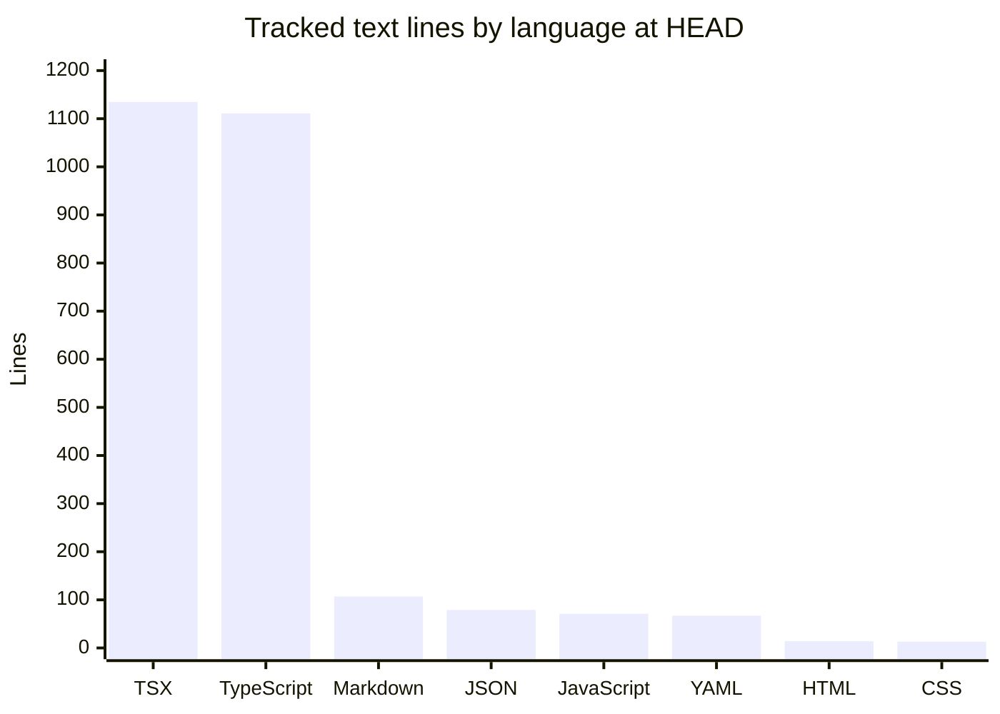

# By the numbers

Data collected on 2026-09-19. A quantitative snapshot of the GTM Partner Dashboard: size, dependency load, recent churn, and the largest files in the tree.

## Repository size by language

The chart below counts lines in tracked text files at `HEAD` (`506f8be`), grouped by language. The machine-generated `package-lock.json` (4,477 lines) and the binary PNG/SVG assets are excluded so the chart reflects hand-written code.

The application itself is TypeScript: 14 TSX files (1,135 lines) and 9 TypeScript modules (1,094 lines) under `src/`, plus `vite.config.ts` (17 lines) at the repo root. Everything else is configuration, documentation (`README.md`), or style.

## Source, test, and config counts

| Category | Files | Lines | Notes |
| --- | --- | --- | --- |
| Source | 23 | 2,229 | `.ts`/`.tsx` under `src/` |
| Styles | 1 | 13 | `src/index.css` |
| Config and tooling | 10 | 195 | `package.json`, `tsconfig*.json` x3, `vite.config.ts`, `tailwind.config.js`, `postcss.config.js`, `eslint.config.js`, `index.html`, `.gitignore` |
| CI workflows | 2 | 67 | `.github/workflows/ci.yml`, `.github/workflows/deploy-pages.yml` |
| Tests | 0 | 0 | No test files, no `test` script in `package.json` |
| Documentation | 1 | 107 | `README.md` |
| Generated | 1 | 4,477 | `package-lock.json` |
| Binary assets | 3 | – | `docs/screenshots/*.png` (2), `public/favicon.svg` (1) |

The tree tracks 41 files at `HEAD`. The source total of 2,229 lines covers 23 files: 14 TSX components and views (1,135 lines) and 9 TypeScript modules (1,094 lines), split across `src/data` (718), `src/lib` (376), `src/components` (492), `src/views` (557), and the two app entry files `src/App.tsx` + `src/main.tsx` (86).

## Dependencies

16 direct dependencies: 5 runtime (`react`, `react-dom`, `recharts`, `@fontsource/geist-sans`, `@fontsource/geist-mono`) and 11 development (`typescript`, `vite`, `@vitejs/plugin-react`, `eslint`, `typescript-eslint`, `tailwindcss`, `postcss`, `autoprefixer`, and the `@types/*` packages). There is no test framework, no backend runtime, and no database client — the app has no server side. See [Dependencies](reference/dependencies.md) for the annotated list.

## Recent activity and churn

The entire history spans 2026-09-18 to 2026-09-19 across two branches:

- `0f9728f` (2026-09-18) `chore: initialize repository` — 2 files, 22 insertions (`README.md`, `.gitignore`).
- `90cab73` (2026-09-18) `feat: partner revenue pipeline dashboard mockup` — 38 files, 6,842 insertions, 4 deletions. Nearly the whole application arrived in this single change.
- `28ed80c` (2026-09-19) merge of pull request #1 — no changes of its own.
- `35ff45b` + `506f8be` (2026-09-19) follow-ups on `feat/partner-revenue-pipeline-mockup`: slice toggles, funnel unit fix, host-aware base path, retired automatic Pages deploy.

On `origin/main` (3 commits, 39 tracked files), `README.md` is the only file changed more than once, at 2 changes; every other tracked path was changed exactly once. The current `HEAD` is `506f8be`.

## Bot-attributed commits

2 of the 3 commits on `origin/main` carry a `Co-authored-by: factory-droid[bot]` trailer (`0f9728f` and `90cab73`; the merge commit `28ed80c` does not), so at least 66.7% of default-branch commits are bot-attributed. That figure is a lower bound: a co-author trailer records bot involvement on the change but says nothing about authorship share, and the merge commit's missing trailer does not prove no bot involvement. The only human author on the default branch is Smash4920. Both branch-only commits (`35ff45b`, `506f8be`) also carry the trailer, so 4 of 5 commits repository-wide are bot-attributed.

## Largest source files

| File | Lines | Role |
| --- | --- | --- |
| `src/data/mock/generate.ts` | 397 | Deterministic, seeded generator for the entire mock book of business |
| `src/lib/metrics.ts` | 337 | All derived metrics: funnel, pipeline, win rate, targets, leaderboard |
| `src/views/LeadershipView.tsx` | 322 | Aggregate GTM leadership view |
| `src/views/PartnerView.tsx` | 235 | Partner-scoped portal view with motion slices |
| `src/data/constants.ts` | 106 | Stages, opportunity types, statuses, palette, snapshot date |
| `src/components/RegistrationsTable.tsx` | 103 | Pending registrations queue and partner history table |

The six largest files account for 1,500 of the 2,229 source lines (67%). The largest file, `src/data/mock/generate.ts`, is the data source, not a view; the view layer stays thin by delegating all calculation to `src/lib/metrics.ts`.

## Related pages

- [Architecture](overview/architecture.md) — how the provider feeds the metric and view layers.
- [Dependencies](reference/dependencies.md) — annotated dependency list.
- [Deployment](deployment.md) — how the app is built and hosted.
- [Lore](lore.md) — how these numbers came to be, dated era by era.
- [Fun facts](fun-facts.md) — short verifiable oddities.
