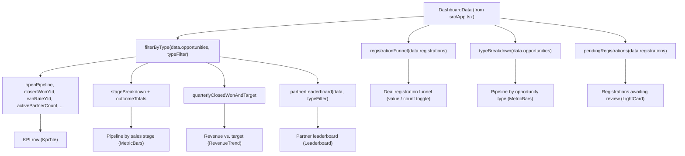

# Leadership dashboard

Active contributors: Smash4920

The GTM Leadership view is the internal aggregate view. It shows all partners at once: the deal-registration funnel, open pipeline and stages, closed revenue against target, a pending-review queue, and a partner leaderboard. `src/App.tsx` renders it whenever the GTM Leadership tab is selected.

## Purpose

GTM leadership and operations use this view to answer three questions:

- How much partner pipeline exists, and where is it in the funnel or sales stage?
- How does closed revenue compare with the combined partner targets, by quarter and year to date?
- Which registrations are waiting for a decision, and which partners are leading?

Every record — all 25 partners, all registrations, and all opportunities — contributes to this view. It is the counterpart to the [partner portal](partner-portal.md), which shows the same data scoped to one partner and without internal-only Sell To opportunities.

## Source layout

| Path | Role in this feature |
| --- | --- |
| `src/views/LeadershipView.tsx` | The whole view: filter state, derived rows, and layout |
| `src/lib/metrics.ts` | Every derived number the view displays |
| `src/lib/format.ts` | Currency, percentage, and date formatting |
| `src/data/types.ts` | The `DashboardData`, `Opportunity`, and `DealRegistration` shapes |
| `src/data/constants.ts` | Stage and type metadata, colors, quarters, snapshot date |
| `src/components/KpiTile.tsx` | KPI tile presentation |
| `src/components/MetricBars.tsx` | Horizontal bars for funnel, stage, and type panels |
| `src/components/RevenueTrend.tsx` | Quarterly chart |
| `src/components/FilterChips.tsx` | Type filter and funnel measure toggle |
| `src/components/RegistrationsTable.tsx` | Pending queue table |
| `src/components/Leaderboard.tsx` | Partner ranking table |
| `src/components/Card.tsx`, `src/components/LightCard.tsx` | Panel surfaces |
| `src/App.tsx` | Passes the loaded `data` and switches views |

## Key abstractions

| Abstraction | Where | Role |
| --- | --- | --- |
| `TypeFilter` | `src/views/LeadershipView.tsx` | `'all'` or one of the three opportunity types; re-derives most panels |
| `FunnelMeasure` | `src/views/LeadershipView.tsx` | `'value'` or `'count'` measure for the registration funnel |
| Filtered `opps` | `src/views/LeadershipView.tsx` | `filterByType(data.opportunities, typeFilter)` from `src/lib/metrics.ts` |
| Metric functions | `src/lib/metrics.ts` | Pure derivations: funnel, stages, outcomes, types, quarterly revenue, leaderboard, pending queue |
| `MetricBarRow` | `src/components/MetricBars.tsx` | Display-ready bar rows shared by the funnel, stage, and type panels |
| `QuarterRevenueRow` | `src/lib/metrics.ts` | Quarterly `closedWon` and `target` pairs fed to `RevenueTrend` |
| `LeaderboardRow` | `src/lib/metrics.ts` | Partner ranking entries rendered by `Leaderboard` |

## How it works

Two inputs drive the view: the type filter (top right of the header) and the funnel measure toggle (inside the funnel card). The type filter feeds `filterByType` from `src/lib/metrics.ts` and re-derives the KPI row, stage panel, revenue chart, and leaderboard. The funnel measure toggle only changes how the funnel panel displays its data.

The type breakdown panel, the registration funnel, and the pending queue intentionally ignore the type filter. Registrations carry no `oppType` — they are untyped by design — so the funnel and queue always cover all registrations, and the type panel always charts all three motions.

## Filters

The header chips (`TYPE_OPTIONS` in `src/views/LeadershipView.tsx`) filter by opportunity type: All, Sell To, Sell With, or Allocate. Selecting one restricts the filtered `opps` set, which changes:

- The KPI row
- Pipeline by sales stage (including won/lost outcomes)
- Revenue vs. target
- The partner leaderboard

A note under the type panel repeats the scope: KPIs, stages, revenue, and the leaderboard filter; registrations stay unfiltered because they are untyped.

## KPI row

The four-up grid (`src/components/KpiTile.tsx`) shows eight tiles. All values come from `src/lib/metrics.ts`:

| Tile | Function | Notes |
| --- | --- | --- |
| Open pipeline | `openPipeline(opps)` | Value and count of open (undecided) opportunities |
| Closed-won YTD | `closedWonYtd(opps)` | Won revenue from Jan 1 of the current year through the snapshot; shows a YoY delta against `closedWonPriorYearSamePeriod(opps)` and attainment against `ytdTarget(data.targets)` |
| Pipeline coverage | `coverageRatio(opps, data.targets)` | Open pipeline over remaining quota; `formatCoverage` renders "Target met" when the quota is already closed |
| Deal-reg approval | `approvalRate(data.registrations)` | Approved over decided registrations; subtitle shows how many were decided |
| Reg → qualified opp | `registrationConversionRate(data.registrations)` | Converted over approved registrations |
| Win rate | `winRateYtd(opps)` | Won over won plus lost, within the current YTD window |
| Active partners | `activePartnerCount(opps, data.registrations)` | Partners with an opportunity or registration this calendar year, of 25 enrolled |
| Avg open deal | `avgOpenDealSize(opps)` | Open pipeline value divided by open opportunity count |

The registration-derived tiles (approval and conversion) never respond to the type filter, matching the "registrations are untyped" rule.

## Deal registration funnel

The "Deal registration funnel" card walks registrations from submitted to converted, with rejected and still-pending records alongside: Submitted, Approved, Converted to opp, Rejected (dimmed, graphite), and Pending review (signal orange). The rows come from `registrationFunnel` in `src/lib/metrics.ts`.

Every funnel row carries both a count and a dollar total. The dollars are the partner-estimated deal value captured at submission — `DealRegistration.amount` in `src/data/types.ts` — not the sales-sized `Opportunity.amount`. Those two numbers diverge in a real CRM, so the code never sums them together.

The panel lets the user pick one measure with `FUNNEL_MEASURE_OPTIONS` in `src/views/LeadershipView.tsx`: "Registered $" (`value`) or "Count" (`count`). The selected measure drives both the bar length and the printed number, and the other measure appears as the secondary caption (for example "12 regs" next to a dollar bar, or the dollar figure next to a count bar). The view comments note this so the panel never mixes registration counts with registered dollars.

## Sales-stage and outcome panel

"Pipeline by sales stage" renders the open opportunities across the six stages from `STAGES` in `src/data/constants.ts`, in order: Discovery, Scope, Tech Validation, Business Case, Vendor of Choice, then Deal Desk Review. Each row comes from `stageBreakdown(opps)` and is colored from `STAGE_META` (a graphite ramp that lightens as deals progress).

Two terminal rows are appended under the stages: "Won (all time)" from `outcomeTotals(opps)` in metric green (`WON_COLOR`), and "Lost (all time)" in dimmed graphite (`LOST_COLOR`). Won and Lost are outcomes, not open stages, so they appear here rather than in the stage list.

## Revenue vs. target

"Revenue vs. target" feeds `quarterlyClosedWonAndTarget(opps, data.targets)` from `src/lib/metrics.ts` into `src/components/RevenueTrend.tsx`. The chart spans the eight quarters `2024-Q4` through `2026-Q3` from `QUARTERS` in `src/data/constants.ts`: closed-won bars in metric green against the combined partner target as a dashed granite line. Targets are aggregated across all partners per quarter.

## Opportunity-type breakdown

"Pipeline by opportunity type" shows the open pipeline split into Sell To, Sell With, and Allocate using `typeBreakdown(data.opportunities)` and `OPP_TYPE_META` colors (Sell To `#b8b3b0`, Sell With `#eeeeee`, Allocate `#8a8380`). As noted above, this panel always shows all three motions — it does not respond to the type filter.

## Pending review queue

"Registrations awaiting review" sits in a `LightCard` — the one bright surface on the near-black canvas, reserved for the thing that needs attention. `pendingRegistrations(data.registrations)` returns pending registrations oldest first, and `src/components/RegistrationsTable.tsx` renders them with the `queue` variant, showing how many days each has waited (more than 10 days highlights in signal orange). The view caps the table at 7 rows. Rejection decisions and reasons belong to the history view in the [partner portal](partner-portal.md), not this queue.

## Leaderboard

"Partner leaderboard" ranks partners by `partnerLeaderboard(data, typeFilter)` from `src/lib/metrics.ts`: closed-won YTD descending, then open pipeline descending as the tiebreaker. Each row shows open pipeline, closed-won YTD, and win rate, with tier and type badges. The view passes `limit={10}`, so only the top ten partners appear.

## Integration points

- Data arrives as a `data` prop of type `DashboardData` from `src/App.tsx`; the view holds no data-loading logic.
- All derivations live in `src/lib/metrics.ts`; the view maps them into `MetricBarRow`s for `src/components/MetricBars.tsx`.
- Domain labels and colors come from `src/data/constants.ts`, not from view-local literals (chart colors are the only inline exceptions).
- The unit contract matters at this boundary: registration amounts are partner estimates at submission, opportunity amounts are sales-sized, and they are never summed together.
- Two data-provider methods back this view conceptually: `listOpportunities()` and `listRegistrations()` from `src/data/DataProvider.ts`; targets come from `getTargets()`.

## Entry points for modification

- Change the type filter or funnel measure options in `TYPE_OPTIONS` / `FUNNEL_MEASURE_OPTIONS` in `src/views/LeadershipView.tsx`.
- Add or change a KPI by editing the `KpiTile` grid in `src/views/LeadershipView.tsx` and, if it needs new math, adding a helper to `src/lib/metrics.ts`.
- Adjust stage labels, colors, or the current year/quarters in `src/data/constants.ts`.
- Tune leaderboard or queue depth via the `limit` props passed to `Leaderboard` and `RegistrationsTable` in `src/views/LeadershipView.tsx`.
- Restyle the chart (bar colors, target line, tooltip) in `src/components/RevenueTrend.tsx`.

## Key source files

| File | Role |
| --- | --- |
| `src/views/LeadershipView.tsx` | Filter state, derived rows, and panel layout |
| `src/lib/metrics.ts` | Pipeline, funnel, stage, outcome, type, target, and leaderboard math |
| `src/lib/format.ts` | `formatUsdCompact`, `formatPct`, `formatDate`, `formatCoverage` output helpers |
| `src/data/constants.ts` | `STAGES`, `STAGE_META`, `OPP_TYPES`, `OPP_TYPE_META`, `QUARTERS`, colors, snapshot date |
| `src/data/types.ts` | `DashboardData`, `Opportunity`, `DealRegistration`, `Target` |
| `src/components/KpiTile.tsx` | KPI tile markup |
| `src/components/MetricBars.tsx` | Funnel, stage, and type bar rows |
| `src/components/RevenueTrend.tsx` | Recharts quarterly chart |
| `src/components/FilterChips.tsx` | Type filter and funnel measure chips |
| `src/components/RegistrationsTable.tsx` | Pending queue table |
| `src/components/Leaderboard.tsx` | Partner ranking table |
| `src/components/Card.tsx`, `src/components/LightCard.tsx` | Panel surfaces |

See [Partner portal](partner-portal.md) for the partner-scoped counterpart, or the [features index](index.md) for the lens overview.
