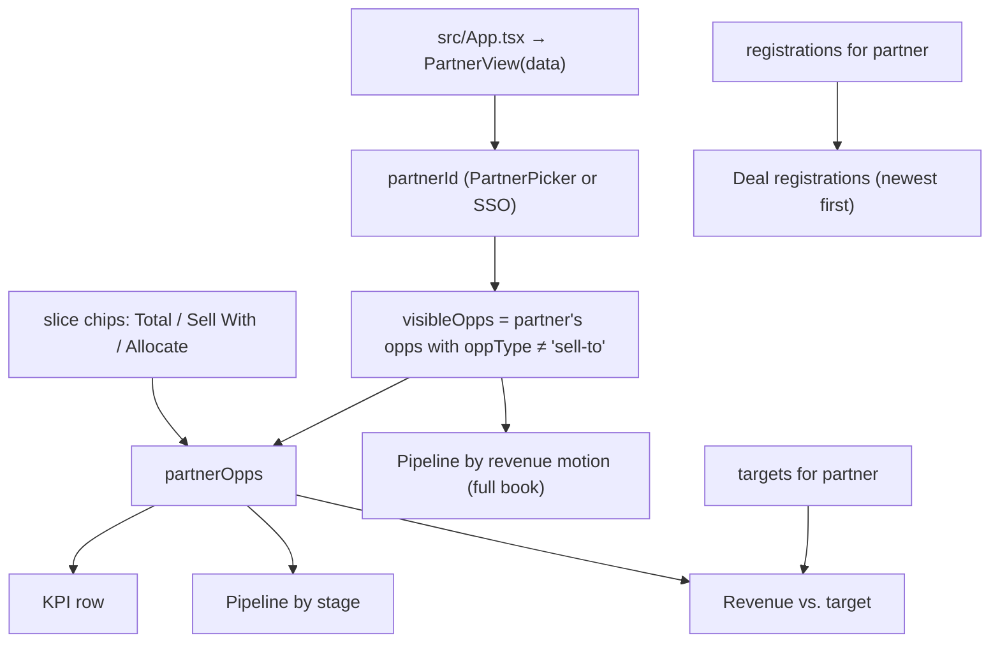

# Partner portal

Active contributors: Smash4920

The Partner Portal is the partner-facing view. It shows one partner's own registrations, open pipeline, revenue against target, and registration history, and it deliberately hides internal-only Sell To opportunities. `src/App.tsx` renders it whenever the Partner Portal tab is selected.

## Purpose

A partner uses this view to see their book of business with the company: which of their deal registrations are pending, approved, or rejected; where their open opportunities sit in the sales stages; how their revenue splits across revenue motions; and how their closed-won revenue compares with their quarterly targets.

In the mockup, a picker selects which partner to impersonate. In production the same view would sit behind partner SSO, and the picker would not exist — the partner identity comes from the session.

## Source layout

| Path | Role in this feature |
| --- | --- |
| `src/views/PartnerView.tsx` | The whole view: partner and slice state, derived rows, and layout |
| `src/components/PartnerPicker.tsx` | Prototype partner selector |
| `src/lib/metrics.ts` | Pipeline, target, stage, and registration derivations |
| `src/lib/format.ts` | Currency, percentage, and date formatting |
| `src/data/types.ts` | The `Partner`, `Opportunity`, `DealRegistration`, and `Target` shapes |
| `src/data/constants.ts` | Tier, type, region, stage, and registration-status metadata and colors |
| `src/components/KpiTile.tsx`, `src/components/MetricBars.tsx`, `src/components/RevenueTrend.tsx`, `src/components/RegistrationsTable.tsx`, `src/components/FilterChips.tsx`, `src/components/Card.tsx`, `src/components/Badge.tsx` | Panel rendering |
| `src/App.tsx` | Passes the loaded `data` and switches views |

## Key abstractions

| Abstraction | Where | Role |
| --- | --- | --- |
| `PartnerSlice` | `src/views/PartnerView.tsx` | `'all'`, `'sell-with'`, or `'allocate'` selected slice |
| `partnerId` | `src/views/PartnerView.tsx` | Selected partner identity (picker today, SSO in production) |
| `visibleOpps` | `src/views/PartnerView.tsx` | The partner's opportunities minus Sell To — everything they are allowed to see |
| `partnerOpps` | `src/views/PartnerView.tsx` | `visibleOpps` narrowed to the selected slice |
| `partnerTargets` | `src/views/PartnerView.tsx` | Targets filtered to the selected partner |
| `partnerRegistrations` | `src/views/PartnerView.tsx` | The partner's registrations, used for the lifetime count and history |
| `SLICE_OPTIONS` | `src/views/PartnerView.tsx` | Total pipeline / Sell With / Allocate chip options |

## How it works

The partner's identity determines everything downstream: opportunities, targets, and registrations are all filtered by `partnerId`. The Sell To exclusion happens before any slice is applied, so a partner can never see internal-only deals no matter what they select.

## Partner selection: prototype picker vs. future SSO

In the mockup, `src/components/PartnerPicker.tsx` renders a dropdown of all partners sorted by name, labeled "Viewing as". The view defaults to the top partner on the closed-won YTD leaderboard — `partnerLeaderboard(data, 'all')[0]` — so the first screen is representative rather than arbitrary.

The picker is explicitly a stand-in for authentication. The comment in `src/components/PartnerPicker.tsx` says the view "sits behind partner SSO and the picker does not exist" in production, and `src/views/PartnerView.tsx` prints "In production, scoped by partner SSO" under the controls. The header also shows the partner's tier badge (Platinum, Gold, Silver, or Registered), partner type (Reseller, Agency, MSP, Integrator, or Referral), region (North America, EMEA, APAC, LATAM), account manager, partner-since date, and lifetime registration count.

If the selected `partnerId` does not resolve to a partner, the view renders "No partners available."

## Sell To exclusion

Sell To is the motion where the company sells directly to the partner — the partner is the customer. It is internal information, so the portal filters it out at the source: `visibleOpps` in `src/views/PartnerView.tsx` keeps only opportunities where `opp.partnerId === partnerId && opp.oppType !== 'sell-to'`.

The same rule is documented on the domain model: `src/data/types.ts` states that the partner-facing view "intentionally excludes Sell To." Sell To remains visible in the internal [leadership dashboard](leadership-dashboard.md), where the type filter includes it.

## Pipeline slices

Three chips under the picker (Total pipeline, Sell With, Allocate, from `SLICE_OPTIONS` in `src/views/PartnerView.tsx`) narrow the partner's working set:

- Total pipeline (`'all'`): all of `visibleOpps`.
- Sell With (`'sell-with'`): only `oppType === 'sell-with'` opportunities.
- Allocate (`'allocate'`): only `oppType === 'allocate'` opportunities.

The slice applies to the KPI row, the stage panel, and the revenue trend because those derive from `partnerOpps`. Two things deliberately ignore the slice: the revenue-motion panel always shows the full book (see below), and target figures always cover all revenue, so a sliced closed-won number is compared against nothing smaller than the whole target.

## Partner KPIs

The four-up grid shows four tiles, all derived from `src/lib/metrics.ts`:

| Tile | Function | Behavior |
| --- | --- | --- |
| Open pipeline | `openPipeline(partnerOpps)` | Label switches to "Open Sell With pipeline" (or Allocate) when a slice is selected; the "Total pipeline" label shows count plus coverage against remaining quota (`coverageRatio`), or "target met" |
| Closed-won YTD | `closedWonYtd(partnerOpps)` | Shows attainment against `ytdTarget(partnerTargets)` on Total; on a slice it shows "Sell With only · target covers all revenue" |
| Win rate | `winRateYtd(partnerOpps)` | Won over won plus lost, within the YTD window |
| Awaiting review | `pendingRegistrations(data.registrations, partnerId).length` | How many of the partner's registrations are still pending |

## Target trend

"Revenue vs. target" feeds `quarterlyClosedWonAndTarget(partnerOpps, partnerTargets)` into `src/components/RevenueTrend.tsx`. Closed-won bars are drawn per quarter against the partner's target line across the eight quarters `2024-Q4` through `2026-Q3`. When a slice is selected, the panel header says the target covers all revenue — the target unfiltered, the bars sliced.

## Stage and motion panels

"Pipeline by stage" renders `stageBreakdown(partnerOpps)` with `STAGE_META` labels and colors: Discovery, Scope, Tech Validation, Business Case, Vendor of Choice, and Deal Desk Review, each showing open opportunity count and dollar value.

"Pipeline by revenue motion" is a second bar panel that always computes over everything the partner can see, regardless of the selected slice: `openPipeline` over `visibleOpps`, then over just the Sell With subset and just the Allocate subset. It renders three rows — Total pipeline, Sell With, Allocate — so the partner can always see their full-book split side by side with the slice they selected above.

## Registration history

"Deal registrations" lists the partner's eight most recent registrations via `recentRegistrations(data.registrations, partnerId, 8)`, newest first, with all statuses. `src/components/RegistrationsTable.tsx` renders them with the `history` variant (partner column hidden, decision dates shown, rejection reasons listed under the account name for rejected rows). Status colors come from `REGISTRATION_STATUS_META` in `src/data/constants.ts`: signal orange for pending, metric green for approved, neutral graphite for rejected.

The pending count in the KPI row and the full history here are the same underlying `DealRegistration` records for the partner.

## Integration points

- Data arrives as a `data` prop of type `DashboardData` from `src/App.tsx`; the view holds no loading logic.
- Identity is a local `useState` in production shape — the SSO seam is the `partnerId` value that `PartnerPicker` sets.
- The Sell To exclusion is enforced in the view's `visibleOpps` filter and documented in `src/data/types.ts`; both places must stay in agreement.
- All derivations come from `src/lib/metrics.ts`; the motion split, stage rows, and quarterly trend are mapped into display rows for `src/components/MetricBars.tsx` and `RevenueTrend`.
- Tier, type, region, stage, and status metadata and colors come from `src/data/constants.ts`.

## Entry points for modification

- Change the default partner in the `useState` initializer at the top of `src/views/PartnerView.tsx` (currently the top of the leadership leaderboard).
- Migrate to real authentication by replacing `PartnerPicker` with a session-provided partner id; the `visibleOpps` filter already scopes by `partnerId`.
- Change which motions a partner can see by editing the `opp.oppType !== 'sell-to'` condition in `src/views/PartnerView.tsx`.
- Adjust slice options in `SLICE_OPTIONS` in `src/views/PartnerView.tsx`.
- Change history depth or ordering via the `recentRegistrations` call and the `limit` prop passed to `RegistrationsTable` in `src/views/PartnerView.tsx`.
- Fix a wrong number by checking the relevant function in `src/lib/metrics.ts` first, then the panel wiring in the view.

## Key source files

| File | Role |
| --- | --- |
| `src/views/PartnerView.tsx` | Partner and slice state, Sell To exclusion, derived rows, layout |
| `src/components/PartnerPicker.tsx` | Prototype identity selector |
| `src/lib/metrics.ts` | Pipeline, coverage, quarterly, stage, pending, and recent-registration math |
| `src/lib/format.ts` | Currency, percentage, and date formatting |
| `src/data/constants.ts` | Partner tier/type/region, stage, and registration-status metadata |
| `src/data/types.ts` | Canonical shapes, including the Sell To exclusion note |
| `src/components/KpiTile.tsx` | KPI tiles |
| `src/components/MetricBars.tsx` | Stage and motion bars |
| `src/components/RevenueTrend.tsx` | Quarterly revenue vs. target chart |
| `src/components/RegistrationsTable.tsx` | Registration history table |
| `src/components/FilterChips.tsx` | Slice chips |
| `src/components/Card.tsx`, `src/components/Badge.tsx` | Panels and status/tier badges |

See [Leadership dashboard](leadership-dashboard.md) for the internal aggregate counterpart, or the [features index](index.md) for the lens overview.
