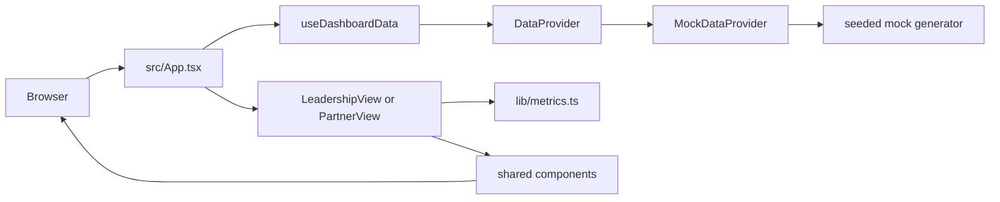

# Architecture

The dashboard is a single Vite-built React application. `src/App.tsx` creates a data provider, `src/data/useDashboardData.ts` loads the four data collections, the two view modules derive display metrics, and shared components render cards, bars, charts, tables, and badges.

## System flow

`src/data/DataProvider.ts` defines the only source contract the UI needs. `src/data/mock/MockDataProvider.ts` implements it today by creating one in-memory `DashboardData` object with `src/data/mock/generate.ts`. The four provider methods are loaded in parallel by `src/data/useDashboardData.ts`.

## Data and rendering layers

### Data layer

`src/data/types.ts` contains the canonical `Partner`, `DealRegistration`, `Opportunity`, `Target`, and `DashboardData` shapes. `src/data/constants.ts` holds stage order, opportunity-type metadata, status labels, the fixed snapshot date, quarter list, and chart colors.

### Metric layer

`src/lib/metrics.ts` turns raw records into view-ready values. It calculates open pipeline, closed-won revenue, win rate, registration funnel totals, stage and type breakdowns, target coverage, quarterly revenue, pending registrations, and the partner leaderboard. `src/lib/format.ts` keeps currency, percentage, and date presentation consistent.

The registration funnel carries both counts and partner-estimated dollars. Those dollars are the estimate captured when a registration was submitted. They are not added to opportunity amounts, which are sized later by sales.

### View and component layers

`src/views/LeadershipView.tsx` filters aggregate opportunities by revenue motion and renders KPIs, the registration funnel, stage breakdown, target trend, type breakdown, pending queue, and leaderboard. `src/views/PartnerView.tsx` first removes internal-only Sell To opportunities, then scopes the remaining data to one partner and an optional Sell With or Allocate slice.

The shared components in `src/components/` are presentation-focused. `MetricBars.tsx` renders horizontal measures, `RevenueTrend.tsx` renders the quarterly chart with Recharts, and `RegistrationsTable.tsx` renders either the internal pending queue or partner history.

## Runtime boundary

There is no server runtime in this repository. Vite serves the development app and produces static files in `dist/`. The build base is selected in `vite.config.ts`: Vercel uses `/`, while a GitHub Pages project site uses `/GTM-Partner-Dashboard/`. `BASE_PATH` overrides both defaults.

The app currently has no API surface. A future provider can call a CRM or warehouse while preserving the `DashboardData` shapes, or it can adapt source records inside its provider implementation. View code should not learn about CRM-specific fields.

## Source languages and size

The application source is TypeScript and TSX. The current `src/` tree contains 23 source files and 2,229 lines. The project also has JavaScript configuration files, YAML GitHub Actions workflows, Markdown documentation, and SVG/PNG assets.

For the quantitative snapshot and recent history, see [By the numbers](../by-the-numbers.md). For the domain shapes, see [Data models](../reference/data-models.md).
