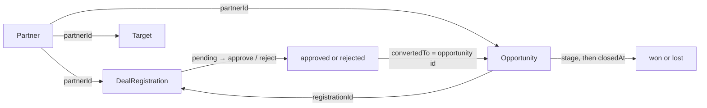

# Data models

The canonical data model lives in `src/data/types.ts`. Every record the views render flows through these shapes via the `DataProvider` interface in `src/data/DataProvider.ts`, so the shapes below are also the contract a future CRM or warehouse adapter must satisfy. The shared enumeration values and their display labels live in `src/data/constants.ts`.

## Domain entities

### Partner

A partner account participating in the program.

| Field | Type | Notes |
| --- | --- | --- |
| `id` | `string` | Stable key; referenced as `partnerId` by the other records |
| `name` | `string` | Display name |
| `type` | `PartnerType` | One of reseller, agency, msp, integrator, referral |
| `tier` | `PartnerTier` | Platinum, Gold, Silver, or Registered; the mock generator uses tiers to weight activity and targets |
| `region` | `Region` | `na`, `emea`, `apac`, or `latam` |
| `accountManager` | `string` | Internal owner of the relationship |
| `joinedAt` | `string` (ISO 8601) | Partnership start date |

### DealRegistration

A partner-submitted request to register a potential deal, awaiting or carrying an ops decision.

| Field | Type | Notes |
| --- | --- | --- |
| `id` | `string` | Stable key |
| `partnerId` | `string` | References `Partner.id` |
| `accountName` | `string` | The target account the partner wants to register |
| `amount` | `number` | Partner-estimated deal value at submission; not the same as the opportunity amount below |
| `submittedAt` | `string` (ISO 8601) | Submission date |
| `status` | `RegistrationStatus` | `pending`, `approved`, or `rejected` |
| `decisionAt` | `string` (ISO 8601), optional | Set once approved or rejected |
| `decidedBy` | `string`, optional | Who made the decision |
| `reason` | `string`, optional | Rejection reason |
| `convertedTo` | `string`, optional | Opportunity id once the registration converted |

### Opportunity

A sales opportunity that may be revenue-attributed to a partner.

| Field | Type | Notes |
| --- | --- | --- |
| `id` | `string` | Stable key |
| `partnerId` | `string` | References `Partner.id` |
| `registrationId` | `string`, optional | Set when the opportunity came from an approved deal registration |
| `accountName` | `string` | The end-customer or deal account |
| `oppType` | `OpportunityType` | `sell-to`, `sell-with`, or `allocate` |
| `stage` | `OpportunityStage` | One of the six open stages, or the deal has closed |
| `amount` | `number` | Sales-sized deal value |
| `createdAt` | `string` (ISO 8601) | Creation date |
| `expectedCloseDate` | `string` (ISO 8601) | Forecast close date |
| `closedAt` | `string` (ISO 8601), optional | Set once closed |
| `outcome` | `OpportunityOutcome`, optional | `won` or `lost` once closed; absent while open |

### Target

A revenue target for one partner for one quarter.

| Field | Type | Notes |
| --- | --- | --- |
| `partnerId` | `string` | References `Partner.id` |
| `quarter` | `string` | For example `2026-Q3` |
| `revenueTarget` | `number` | The target revenue for that quarter |

### DashboardData

The aggregate container returned by the data provider's loader.

| Field | Type | Notes |
| --- | --- | --- |
| `partners` | `Partner[]` | All partner accounts |
| `registrations` | `DealRegistration[]` | All deal registrations |
| `opportunities` | `Opportunity[]` | All opportunities |
| `targets` | `Target[]` | All quarterly targets |

## Union types

The finite states are all string unions declared in `src/data/types.ts`:

| Union | Values | Used by |
| --- | --- | --- |
| `PartnerType` | `reseller`, `agency`, `msp`, `integrator`, `referral` | `Partner.type` |
| `PartnerTier` | `platinum`, `gold`, `silver`, `registered` | `Partner.tier` |
| `Region` | `na`, `emea`, `apac`, `latam` | `Partner.region` |
| `RegistrationStatus` | `pending`, `approved`, `rejected` | `DealRegistration.status` |
| `OpportunityStage` | `discovery`, `scope`, `tech-validation`, `business-case`, `vendor-of-choice`, `deal-desk-review` | `Opportunity.stage` |
| `OpportunityType` | `sell-to`, `sell-with`, `allocate` | `Opportunity.oppType` |
| `OpportunityOutcome` | `won`, `lost` | `Opportunity.outcome` |

Ordered lists and display metadata (stage order, type labels and colors, tier badges, region names, status labels, the quarter list, and the snapshot date) live in `src/data/constants.ts`. Won and Lost are terminal outcomes, not open stages; an opportunity is open exactly when `outcome` is undefined, per `isOpen` in `src/lib/metrics.ts`.

## Relationships and lifecycle

- One `Partner` has many `DealRegistration` records, many `Opportunity` records, and one `Target` per quarter, all keyed by `partnerId`.
- A registration starts `pending`, then becomes `approved` or `rejected` (with `decisionAt`, `decidedBy`, and a rejection `reason` recorded). An approved registration may convert into exactly one opportunity: it carries `convertedTo` with the opportunity id, and the resulting opportunity carries the matching `registrationId`. In the mock, converted opportunities are `sell-with` and the ids follow the `${registration.id}-opp` pattern produced by `src/data/mock/generate.ts`.
- An opportunity is created, moves through the open stages, and once closed records `closedAt` and an `outcome` of `won` or `lost`. Registrations are intentionally untyped — they carry no `oppType` — which is why the leadership view's type filter never changes the funnel or the pending queue.
- `Target` rows act as per-partner, per-quarter benchmarks; there is no link from an opportunity back to a target. Attainment and coverage compare opportunity revenue against the summed `Target.revenueTarget` in `src/lib/metrics.ts`.

## Registration amounts versus opportunity amounts

`DealRegistration.amount` is the partner-estimated deal value captured at submission. `Opportunity.amount` is the sales-sized value on the opportunity record. They diverge in a real CRM — the partner estimates, then sales sizes the deal — and they diverge in the mock generator too, which draws registration amounts from `skewAmount(rand, 15_000, 250_000)` and opportunity amounts from the per-type `AMOUNT_RANGES`.

The code deliberately never sums the two streams together. `registrationFunnel` in `src/lib/metrics.ts` totals registration amounts as a separate submitted-value stream, while open pipeline, closed-won, win rate, and target attainment always derive from `Opportunity.amount` compared with `Target.revenueTarget`. See the [Glossary](../overview/glossary.md) entry on the registration funnel and the [Data provider](../systems/data-provider.md) section on registered dollars for the same rule.

## Source files

| File | Role |
| --- | --- |
| `src/data/types.ts` | Canonical entity and union shapes |
| `src/data/constants.ts` | Enumeration values, labels, colors, snapshot date, quarters |
| `src/data/DataProvider.ts` | Interface returning these shapes |
| `src/data/mock/MockDataProvider.ts` | In-memory implementation returning one `DashboardData` object |
| `src/data/mock/generate.ts` | Deterministic generator producing records that conform to these shapes |
| `src/lib/metrics.ts` | Derivation logic over these shapes: funnel, pipeline, stages, targets, leaderboard |

## Related pages

- [Reference index](index.md) — where this page sits in the lens.
- [Glossary](../overview/glossary.md) — the domain terms in plain words.
- [Data provider](../systems/data-provider.md) — how the shapes are produced and replaced.
- [Leadership dashboard](../features/leadership-dashboard.md) — the funnel and pipeline panels built on these shapes.
- [Partner portal](../features/partner-portal.md) — how the shapes are scoped per partner and why Sell To is excluded.
