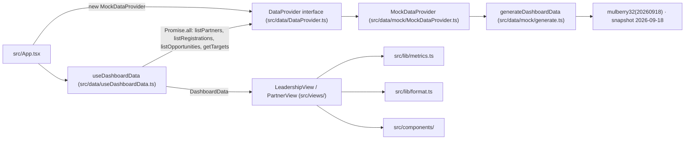

# Data provider

Active contributors: Smash4920

The data provider is the single seam between the GTM Partner Dashboard UI and its data source. Every record the views render arrives through the `DataProvider` interface in `src/data/DataProvider.ts`, and today that interface is implemented by the deterministic mock in `src/data/mock/MockDataProvider.ts`. Because the views only ever see canonical data shapes, a real CRM or warehouse adapter can replace the mock without touching any view code.

## Purpose

The provider exists to answer one question for the app: where does the dashboard data come from? `src/data/DataProvider.ts` defines the contract, `src/data/mock/MockDataProvider.ts` fills it with seeded in-memory data, and `src/data/useDashboardData.ts` loads all four collections together and exposes the `loading` and `error` states the rest of the app reacts to.

## Directory layout

| Path | Purpose |
| --- | --- |
| `src/data/DataProvider.ts` | The `DataProvider` interface: the only source contract the UI needs |
| `src/data/mock/MockDataProvider.ts` | In-memory implementation of the interface |
| `src/data/mock/generate.ts` | Deterministic generator for the whole book of business |
| `src/data/mock/rng.ts` | mulberry32 PRNG and sampling helpers used by the generator |
| `src/data/types.ts` | Canonical `Partner`, `DealRegistration`, `Opportunity`, `Target`, and `DashboardData` shapes |
| `src/data/constants.ts` | Snapshot date, quarters, stage/type/status metadata, and chart colors |
| `src/data/useDashboardData.ts` | Loads the four collections in parallel through the provider |

## Contract

`src/data/DataProvider.ts` declares four methods, all returning promises so the hook uses one code path for both the in-memory mock and a future remote source:

| Method | Returns | Provides | Likely production source |
| --- | --- | --- | --- |
| `listPartners()` | `Partner[]` | Partner accounts with tier, type, region, and account manager | PRM or CRM partner accounts |
| `listRegistrations()` | `DealRegistration[]` | Partner-submitted deal registrations and their decisions | CRM "Deal Registration" custom object |
| `listOpportunities()` | `Opportunity[]` | Opportunities with stage, type, amount, and close outcome | CRM opportunities carrying stage and `oppType` |
| `getTargets()` | `Target[]` | Per-partner, per-quarter revenue targets | Quota objects or a warehouse |

The method names intentionally do not mention a CRM or a warehouse. `src/data/types.ts` defines the five canonical shapes, and `src/data/constants.ts` holds the shared enumerations the shapes reference: `STAGES`, `OPP_TYPES`, `QUARTERS`, `CURRENT_YEAR`, and the fixed `SNAPSHOT_DATE`.

## Key abstractions

| Abstraction | File | Role |
| --- | --- | --- |
| `DataProvider` | `src/data/DataProvider.ts` | Integration seam between the UI and the data source |
| `MockDataProvider` | `src/data/mock/MockDataProvider.ts` | In-memory implementation; one `DashboardData` object built once |
| `DashboardData` | `src/data/types.ts` | Aggregate container holding the four collections |
| `Partner`, `DealRegistration`, `Opportunity`, `Target` | `src/data/types.ts` | Canonical record shapes |
| `useDashboardData` | `src/data/useDashboardData.ts` | Parallel loader exposing `data`, `loading`, and `error` |
| `mulberry32` and sampling helpers | `src/data/mock/rng.ts` | Deterministic randomness for the generator |

## Data flow

`src/App.tsx` creates the provider once with `useMemo(() => new MockDataProvider(), [])` and passes it to `src/data/useDashboardData.ts`. The hook calls all four methods in parallel, assembles the resolved collections into one `DashboardData` object, and hands it to `src/views/LeadershipView.tsx` or `src/views/PartnerView.tsx`. The views derive display values through `src/lib/metrics.ts` and `src/lib/format.ts`; they never call the provider or import mock modules.

## Deterministic mock behavior

`src/data/mock/generate.ts` builds the entire book of business with a single seeded PRNG from `src/data/mock/rng.ts`:

- A mulberry32 generator seeded with `20260918` drives every number, so the data is identical on every load and every build.
- The snapshot is fixed at `2026-09-18T00:00:00Z`. `generate.ts` clamps its own local `SNAPSHOT` constant, and `src/data/constants.ts` exposes the shared `SNAPSHOT_DATE`, `CURRENT_YEAR` (2026), and `QUARTERS` (2024-Q4 through 2026-Q3) used by the metrics.
- The generator runs in a fixed order: `generatePartners()` → `generateRegistrations(partners)` → `generateOpportunities(partners, registrations)` → `generateTargets(partners)`. This yields 25 partners, 180 registrations, roughly 185 opportunities, and 200 targets (25 partners × 8 quarters).

Collection relationships are created inside the generator. Approved registrations can carry a `convertedTo` id of the form `${registration.id}-opp`, and `generateOpportunities` turns those into `sell-with` opportunities with a matching `registrationId`. Additional opportunities are produced independently from `EXTRA_COUNTS` and never pass through deal registration.

The dataset shape is tunable through constants at the top of `src/data/mock/generate.ts`: `TIER_ACTIVITY` and `TIER_TARGET_BASE` (how active and how targeted each partner tier is), `REGISTRATION_COUNT`, `QUARTER_WEIGHTS`, `OPEN_STAGE_WEIGHTS`, `LOST_STAGE_WEIGHTS`, `AMOUNT_RANGES`, and `EXTRA_COUNTS`. Sampling helpers live in `src/data/mock/rng.ts`: `pick`, `chance`, `randInt`, `skewAmount` (low-skewed deal sizes), and `weightedPick`.

One runtime detail: `MockDataProvider` builds its `DashboardData` object once in the constructor and every method call returns the same array references. Views and metrics treat records as read-only, which is also the convention documented in [Patterns and conventions](../how-to-contribute/patterns-and-conventions.md).

## Parallel loading and error behavior

`src/data/useDashboardData.ts` orchestrates the load:

- `Promise.all` fires `listPartners()`, `listRegistrations()`, `listOpportunities()`, and `getTargets()` together. The hook only publishes a `DashboardData` object once all four resolve, so the views never see a partially loaded dataset.
- If any promise rejects, the `catch` branch sets `error` to the rejection message (or `Failed to load dashboard data` for non-`Error` rejections) and flips `loading` to false while leaving `data` null. The mock never rejects today, but a remote adapter can, and the app is already wired for it.
- An `alive` flag set false by the effect cleanup prevents state updates after unmount, and the effect re-runs only when the `provider` reference changes.

`src/App.tsx` renders the three states explicitly: a banner for `error`, a "Loading dashboard data" pulse for `loading`, and the selected view only when `data` is present. The project convention is to preserve this `loading`/`error` behavior and never silently substitute mock data for a failed source.

## Integration points

- `src/data/DataProvider.ts` — the contract every source must satisfy and the only seam the UI depends on.
- `src/App.tsx` — the single place where the concrete provider is instantiated and swapped.
- `src/data/useDashboardData.ts` — assembles provider output into `DashboardData` and owns loading/error state.
- `src/data/types.ts` — the canonical shapes both the source and the views share; a new field is added here before it is used anywhere else.
- `src/lib/metrics.ts` — derives all view-ready numbers from the raw records; provider output is expected to be raw, not pre-aggregated.
- `src/lib/format.ts` — formats currency, percentages, and dates consistently.

The views in `src/views/` and components in `src/components/` are integration boundaries in the other direction: they consume `DashboardData`, filter and scope it (for example the partner portal removes internal-only Sell To opportunities), and must not import CRM or warehouse clients.

## Replacing the mock with a CRM or warehouse adapter

To go live against HubSpot, Salesforce, or a warehouse such as Snowflake or Looker:

1. Implement `DataProvider` in a new file, for example `src/data/CrmDataProvider.ts`, mapping each source object to the canonical types in `src/data/types.ts`. Partner accounts map to `Partner`, a deal-registration custom object to `DealRegistration`, CRM opportunities to `Opportunity` (preserving `stage` and `oppType` semantics), and quota objects or warehouse rows to `Target`.
2. Keep the referential keys consistent within a response set: `Partner.id` (`partnerId` on the other records), `DealRegistration.id`, `Opportunity.registrationId`/`DealRegistration.convertedTo`, and `Target.quarter`.
3. Swap the instance in `src/App.tsx` from `new MockDataProvider()` to the new provider. No view or metric code changes.
4. Keep the four methods returning promises, and keep the existing `loading` and `error` behavior from `src/data/useDashboardData.ts`. If the source is slow, the views already handle the loading state.

Do not put provider code inside views or components, and do not introduce source-specific fields into `src/data/types.ts` for the convenience of a single adapter; adapt inside the provider instead.

## Why registered dollars differ from opportunity dollars

`DealRegistration.amount` is the partner-estimated deal value captured at submission time. `Opportunity.amount` is the sales-sized value carried on the opportunity record. A partner estimates a deal optimistically at registration; sales later sizes the opportunity, so the two numbers diverge in a real CRM and in the mock generator, which draws them from unrelated ranges: registration amounts use `skewAmount(rand, 15_000, 250_000)` in `src/data/mock/generate.ts`, while opportunity amounts come from the per-type `AMOUNT_RANGES` in the same file.

They are deliberately never summed together. `registrationFunnel` in `src/lib/metrics.ts` totals registration amounts as a separate "submitted value" stream, and `src/views/LeadershipView.tsx` lets the user switch the funnel between `Registered $` and `Count` as measures, rather than mixing registration dollars with opportunity dollars. Opportunity revenue (open pipeline, closed-won, win rate) always derives from `Opportunity.amount`; target attainment and coverage compare opportunity revenue to `Target.revenueTarget`. The glossary entry on the [registration funnel](../overview/glossary.md) states the same rule.

## Key source files

| File | Role |
| --- | --- |
| `src/data/DataProvider.ts` | The `DataProvider` interface and the four required methods |
| `src/data/mock/MockDataProvider.ts` | In-memory implementation returning one `DashboardData` object |
| `src/data/mock/generate.ts` | Deterministic, seed-driven generator for all four collections |
| `src/data/mock/rng.ts` | mulberry32 PRNG and sampling helpers |
| `src/data/types.ts` | Canonical record and aggregate shapes |
| `src/data/constants.ts` | Snapshot date, quarters, current year, and metadata constants |
| `src/data/useDashboardData.ts` | Parallel loading with `data`, `loading`, and `error` state |
| `src/App.tsx` | Provider instantiation, loading/error rendering, and view switching |
| `src/lib/metrics.ts` | Derivation of pipeline, funnel, target, and leaderboard metrics |
| `src/lib/format.ts` | Currency, percentage, and date formatting |

## Entry points for modification

- Replace the data source: implement `DataProvider` and swap the constructor call in `src/App.tsx`.
- Reshape the mock dataset: adjust the tier, volume, weight, and amount constants at the top of `src/data/mock/generate.ts`, or add helpers in `src/data/mock/rng.ts`.
- Move the snapshot: update `SNAPSHOT_DATE`, `CURRENT_YEAR`, and `QUARTERS` in `src/data/constants.ts` and the matching local `SNAPSHOT` constant inside `src/data/mock/generate.ts`.
- Extend the data model: add the field to `src/data/types.ts` first, then produce it in the generator and consume it in `src/lib/metrics.ts` and the views.
- Change loading behavior: edit the `Promise.all` flow or state transitions in `src/data/useDashboardData.ts`.
- Change metric derivations: edit `src/lib/metrics.ts`, keeping provider records raw.

## Related pages

- [Systems index](index.md) — where this page fits in the lens.
- [Architecture](../overview/architecture.md) — the data flow from provider to views.
- [Data models](../reference/data-models.md) — the canonical record shapes.
- [Getting started](../overview/getting-started.md) — local setup and the provider swap steps.
- [Patterns and conventions](../how-to-contribute/patterns-and-conventions.md) — data boundaries and async provider conventions.
- [Glossary](../overview/glossary.md) — revenue motions, funnel, and coverage terms.
